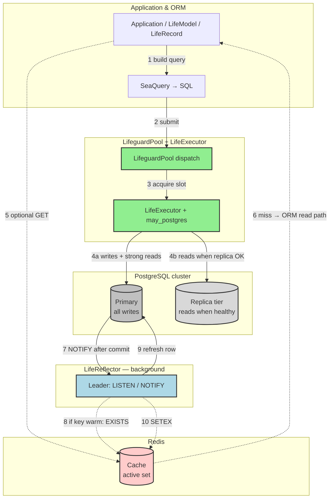
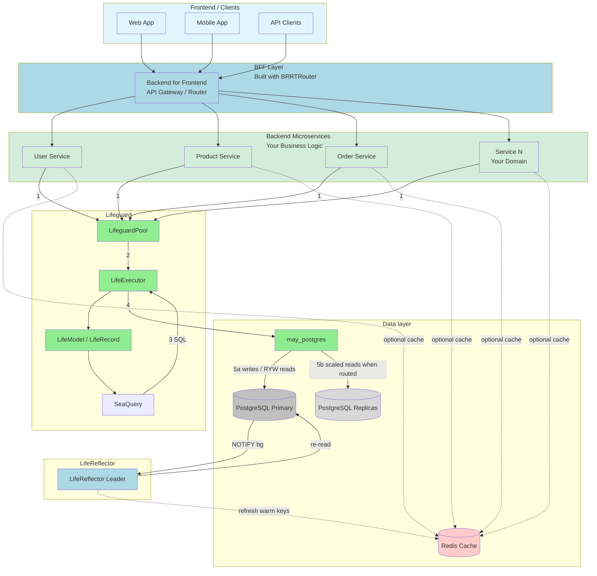
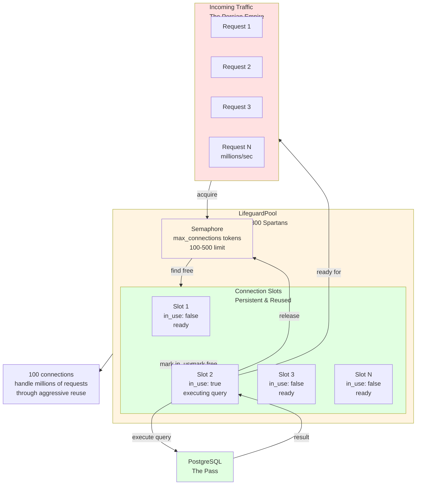
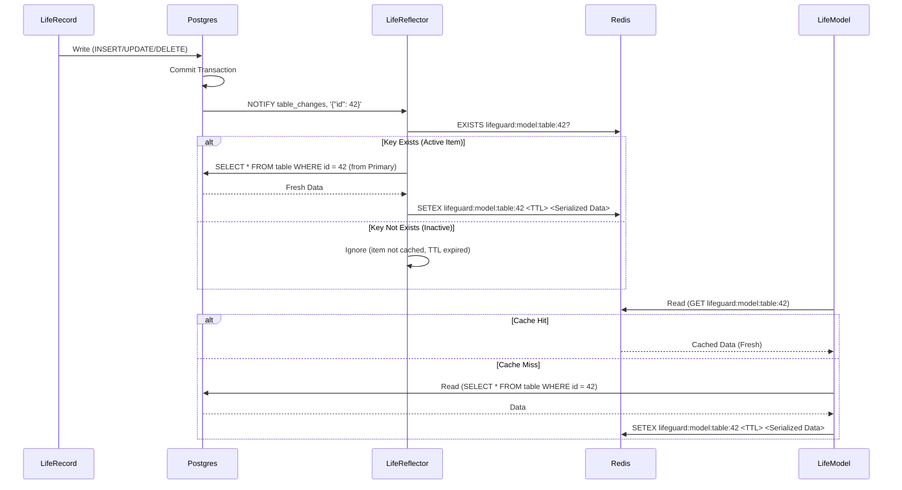

# Lifeguard architecture

This document is the **detailed** architecture reference: numbered call flows (primary vs replicas, Redis, LifeReflector), multi-service deployment, connection pooling, and cache coherence sequences. For repository status see [STATUS.md](./STATUS.md); for quick start and doc index, see the [README](./README.md).

---

## Target architecture

**Numbered edges** show typical **order of operations** on the data plane. **Solid lines** are the ORM/pool path (writes always hit **primary**; reads go to **primary** or **replica** tier depending on `ReadPreference`, WAL lag, and pool routing). **Dotted lines** are **optional** cache-aside (your app or framework checks Redis before Postgres) and **background** coherence (LifeReflector runs out-of-band after commits—not on your request’s critical path).

**Legend (numbers):** **1–4** — synchronous request path through ORM → pool → **primary** (writes, read-your-writes, or forced primary) or **replicas** (scaled reads when the pool routes there). **5–6** — optional Redis **read-through**: not automatic in every API today; pattern is GET first, on miss run **1–4** then populate Redis. **7–10** — **asynchronous**: after a successful commit, **NOTIFY** wakes LifeReflector; it refreshes Redis only for keys already in the active set (see [The Killer Feature: LifeReflector](./VISION.md#the-killer-feature-lifereflector) in **[VISION.md](./VISION.md)**).

**Key Components:**
- **LifeguardPool**: Persistent connection pool; routes to primary vs replica **worker pools** using WAL lag and optional [`ReadPreference`](./src/pool/pooled.rs).
- **LifeExecutor**: Database execution abstraction over `may_postgres`.
- **LifeModel/LifeRecord**: Complete ORM layer (replaces SeaORM).
- **SeaQuery**: SQL building (borrowed, compatible with coroutines).
- **may_postgres**: Coroutine-native PostgreSQL client (foundation).
- **Primary vs replicas**: Writes **always** use the primary URL; reads may use the replica tier when configured and healthy.
- **LifeReflector**: Background cache coherence (not on the hot path of a single `SELECT`).
- **Redis**: Optional cache layer; coherence refresh is **7–10**, not **1–4**.

## Multi-service deployment

**Call order on the request path:** **1** service calls into **`LifeguardPool`** → **2** **`LifeExecutor`** → **3–4** SQL via **`may_postgres`** → **5a** **primary** (all writes; reads when forced or RYW) or **5b** **replicas** (reads when the pool’s WAL/routing allows). **Dotted:** optional Redis in front of Postgres; **NOTIFY** + Reflector runs **asynchronously** after commit (not numbered on the hot path).

## Connection pool architecture

Each **slot** is a long-lived `may_postgres` connection; the pool maintains separate **primary** and **replica** worker tiers when replicas are configured—**writes** and primary-tier reads use primary slots; **replica** slots serve scaled reads when WAL lag allows (see [pool docs](./docs/POOLING_OPERATIONS.md)).

## LifeReflector cache coherence

---

[← README](./README.md) · [Vision](./VISION.md) · [Status](./STATUS.md) · [Comparison](./COMPARISON.md)
