# Building Lifeguard: A Parallel Universe ORM for Rust Coroutines

*How we spent 6 months building a database layer, hit a brick wall, burned it all down, and decided to build an entire ORM from scratch. Because apparently that's the reasonable thing to do.*

**Why?** Because we're building [BRRTRouter](https://github.com/microscaler/BRRTRouter)—a high-performance API router handling 100,000+ requests per second—and [rerp](https://github.com/microscaler/rerp)—a modular ERP system for enterprises of all sizes. Both need a **blistering fast bridge** to PostgreSQL, the wonder of database systems. And existing ORMs? They don't work with coroutines. At all.

---

## Part 1: The Call to Adventure

Let me start with a question that will either make you nod knowingly or scratch your head: **What if I told you that every Rust ORM is fundamentally broken for coroutines?**

Not "suboptimal." Not "could be better." **Fundamentally broken.**

I know, I know. That sounds dramatic. But stick with me here, because we've spent the better part of a year learning this lesson the hard way, and if I can save you from making the same mistakes, then at least something good came out of our spectacular failure.

### The Scene: Why We Need This (The Real-World Problem)

Let me set the stage properly. This isn't an academic exercise. We're building real systems that need real performance.

**BRRTRouter: The High-Performance API Router**

A few years ago, we started building [BRRTRouter](https://github.com/microscaler/BRRTRouter)—a high-performance API router built on Rust's `may` coroutine runtime. If you're not familiar with coroutines, think of them as lightweight threads that run in user space. They're fast. They're predictable. They give you deterministic scheduling and lower memory overhead than traditional async/await.

The performance numbers were beautiful. We were seeing **85,000-120,000 requests per second** with **p99 latencies under 25ms**. The coroutine model was working exactly as advertised.

But then we needed database access. And not just any database access—we needed it to be **blistering fast**. Every millisecond matters when you're handling 100,000 requests per second. A slow database query doesn't just affect one request—it affects thousands.

**rerp: The Modular ERP System**

At the same time, we're building [rerp](https://github.com/microscaler/rerp)—a modular ERP system designed for enterprises of all sizes. It's not a monolithic system, but rather a collection of modules that can be combined to build complete enterprise solutions.

Think about what an ERP system does:
- **Product Management:** Thousands of SKUs, complex pricing rules, inventory tracking
- **Sales & CRM:** Lead management, quotations, orders, invoicing
- **Financial Operations:** General ledger, accounts payable/receivable, financial reporting
- **Manufacturing:** Bill of materials, production planning, supply chain
- **And much more:** HR, project management, eCommerce, POS systems, field service

Every single one of these modules needs database access. And ERP systems aren't just CRUD apps—they're doing complex queries, aggregations, reporting, real-time inventory updates, financial calculations. The database is the **heart** of the system.

**Pricewhisperers: Where Scale Takes an Absurd Turn**

But then there's **Pricewhisperers**. This is where the scale requirements took an absurd turn. The performance needs bordered on the absurd.

We're talking about:
- **50,000 concurrent users** hitting the system simultaneously
- **Millions of requests per second** across REST and gRPC endpoints
- All of this traffic converging on the database like... well, like the Persian Empire converging on Thermopylae

You know the story: King Leonidas I of Sparta led 300 Spartans (plus allies) against the massive Persian army at Thermopylae. It's a story of a small, elite force holding off overwhelming numbers through superior tactics and positioning.

In our case, the "300 Spartans" are the **limited database connections** allowed on cloud databases. Most cloud providers (AWS RDS, Google Cloud SQL, Azure Database) limit you to **100-500 concurrent connections**. That's it. That's your entire army.

But the incoming traffic? That's the Persian Empire. **Millions of requests per second** from 50,000 concurrent users, all needing database access. REST endpoints. gRPC services. Background jobs. Scheduled tasks. All converging on those precious few database connections.

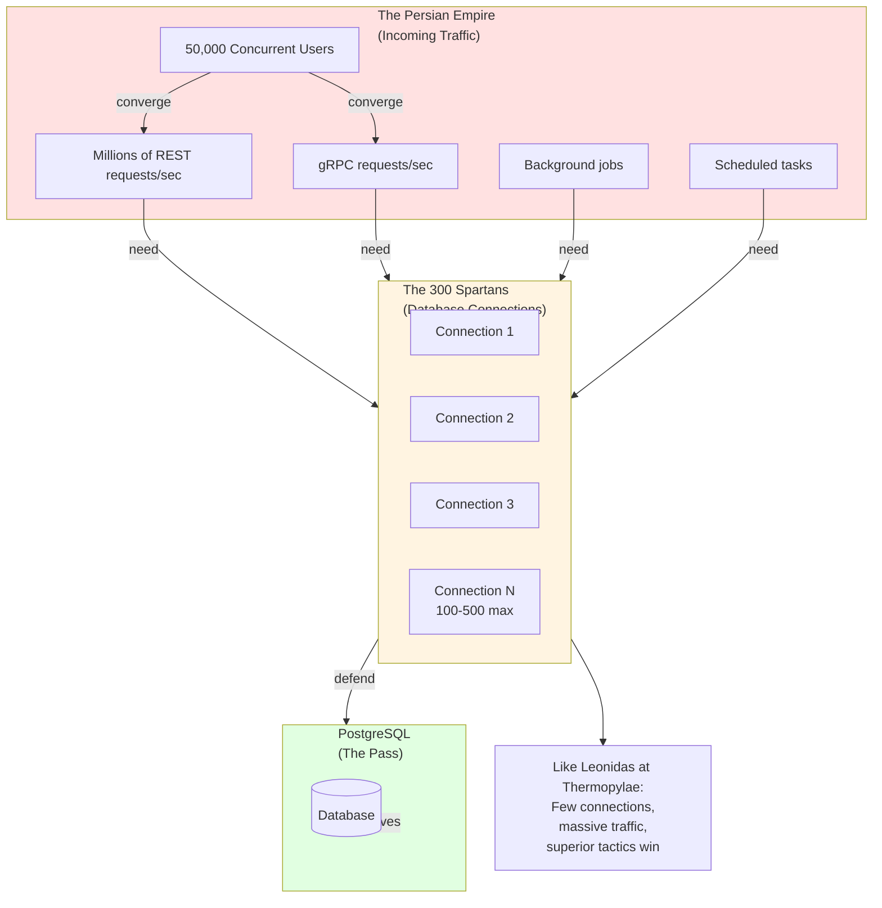

This is where connection pooling becomes **critical**. Not just "nice to have." **Critical.**

If you create a new connection for every request, you'll exhaust your connection limit in seconds. The database will start rejecting connections. Your service will start failing. The Persian Empire (traffic) will overwhelm your 300 Spartans (connections).

But with proper connection pooling:
- **Persistent connections** that are reused aggressively
- **Semaphore-based acquisition** to prevent connection storms
- **Health monitoring** to ensure connections stay alive
- **Intelligent routing** to maximize connection utilization

Your 300 Spartans (connections) can hold the pass (database) against the Persian Empire (traffic).

This is why Lifeguard's connection pool design matters so much. It's not just about performance—it's about **survival at scale**. When you have millions of requests per second and only 100-500 database connections, every connection matters. Every millisecond of connection reuse matters. Every optimization matters.

Pricewhisperers needs a database layer that can:
- Handle millions of requests per second
- Reuse connections aggressively (no connection churn)
- Route queries efficiently (no connection waste)
- Monitor health continuously (no dead connections)
- Scale horizontally (multiple services sharing the connection pool)
- **Transparent caching:** Intelligently check Redis first, fall back to database when needed
- **Intelligent read routing:** Read from replicas when healthy, fall back to primary when lagged
- **Write routing:** Always write to masters (as PostgreSQL was designed)
- **Cache coherence:** LifeReflector ensures Redis stays in sync with database writes
- **PostgreSQL-native:** Use PostgreSQL as the gods designed it—replicas for reads, primary for writes

Lifeguard provides that. A blistering fast bridge to PostgreSQL that makes every connection count. Where 100 connections can handle millions of requests per second through aggressive reuse and intelligent pooling.

**The Transparent Caching System:**

The magic is in the transparency. Your application code doesn't need to know about Redis. It doesn't need to know about replicas. It doesn't need to know about cache coherence. It just calls `User::find_by_id(&pool, 42)?` and Lifeguard handles the rest:

1. **Check Redis first:** Is the data cached? If yes, return it (sub-millisecond read)
2. **Check replica health:** If not cached, is the replica healthy (WAL lag < threshold)? If yes, read from replica
3. **Fall back to primary:** If replica is lagged, read from primary (strong consistency)
4. **Cache the result:** Store in Redis for future reads (LifeReflector keeps it fresh)
5. **Writes go to primary:** Always. As PostgreSQL was designed. LifeReflector handles cache invalidation.

This is how PostgreSQL was meant to be used. Replicas for reads. Primary for writes. Redis for caching. All transparent to your application code. The database layer knows what to do. You just write your business logic.

For Pricewhisperers, this transparency is critical. At millions of requests per second, you can't afford manual cache management. You can't afford to think about replica lag. You can't afford to route queries manually. The system needs to be smart enough to handle it automatically.

Lifeguard is that system. It uses PostgreSQL as the gods designed it. And it makes it transparent to your code.

The story of Leonidas at Thermopylae is about a small force using superior tactics to hold off overwhelming numbers. Lifeguard is about a small number of database connections using superior pooling tactics to handle overwhelming traffic.

The 100 men (connections) defeat the Persian Empire (traffic). Through superior architecture.

**PostgreSQL: The Wonder of Database Systems**

And we're building on **PostgreSQL**—the wonder of database systems. 

PostgreSQL isn't just a database. It's a complete data platform. It's the database that powers everything from small startups to Fortune 500 companies. It's reliable, it's powerful, and it's open source. But more than that, it's **the most advanced open-source database in existence**.

Here's why PostgreSQL is the wonder of database systems:

**ACID Compliance & Advanced Features:**
- Full ACID compliance with advanced transaction isolation levels
- Serializable snapshot isolation for complex concurrent workloads
- Two-phase commit for distributed transactions
- Point-in-time recovery for data protection

**Data Types & Flexibility:**
- **JSONB** for flexible document storage (perfect for ERP's varied data models)
- **Arrays** for storing lists directly in the database
- **Custom types** for domain-specific data modeling
- **Range types** for temporal and numeric ranges
- **UUID** for distributed ID generation

**Query Power:**
- **Full-text search** built-in (no external search engine needed)
- **Window functions** for analytical queries
- **Common Table Expressions (CTEs)** for complex queries
- **Recursive queries** for hierarchical data
- **Lateral joins** for correlated subqueries

**Data Relationships:**
- **Foreign keys** with cascading updates/deletes
- **Views** for logical data abstraction
- **Materialized views** for fast reporting
- **Check constraints** for data validation
- **Exclusion constraints** for complex uniqueness rules

**Advanced Features:**
- **PostGIS** for geospatial data (logistics, field service, mapping)
- **Partitioning** (RANGE, LIST, HASH) for massive scale
- **Replication** (streaming, logical) for high availability
- **Triggers** for automated business logic
- **Stored procedures** in multiple languages (PL/pgSQL, Python, etc.)
- **Extensions** ecosystem (hundreds of extensions available)

**Performance & Scale:**
- Handles terabytes of data
- Supports thousands of concurrent connections
- Advanced query planner and optimizer
- Index types: B-tree, Hash, GiST, GIN, BRIN, SP-GiST
- Parallel query execution
- JIT compilation for complex queries

**Reliability:**
- Write-ahead logging (WAL) for durability
- Point-in-time recovery
- Hot backups
- Streaming replication
- Logical replication for selective data sync

PostgreSQL can handle everything from simple CRUD to complex analytical queries. It's the database that powers:
- **GitHub** (millions of repositories)
- **Instagram** (billions of photos)
- **Uber** (millions of rides)
- **Netflix** (streaming infrastructure)
- **Apple** (iCloud backend)
- **And thousands of other companies**

For BRRTRouter, PostgreSQL provides the reliability and performance we need for authentication, routing rules, and rate limiting.

For rerp, PostgreSQL provides everything an ERP system needs: complex relationships, JSONB for flexible schemas, materialized views for reporting, full-text search for product catalogs, and the reliability to run a business on.

PostgreSQL is the wonder of database systems. And it deserves a fast, coroutine-native ORM to access it.

**The Problem: We Need Speed (And Scale)**

Both BRRTRouter and rerp have the same fundamental requirement: **we need a blistering fast bridge to PostgreSQL**.

For BRRTRouter, every database query adds latency. At 100,000 requests per second, even a 1ms query adds up. We need sub-millisecond database access. We need predictable latency. We need the database layer to be as fast as the router itself.

For rerp, the database is the foundation. Every module depends on it. Every operation touches it. Inventory updates need to be instant. Financial calculations need to be fast. Reporting queries need to complete in seconds, not minutes. The ERP system is only as fast as its database access.

For Pricewhisperers, the requirements are... absurd. **50,000 concurrent users. Millions of requests per second.** All hitting a database with only 100-500 connections available. This is where connection pooling becomes a matter of survival, not optimization.

The cloud database connection limits are like Leonidas's 300 Spartans. The incoming traffic is like the Persian Empire. You need superior tactics (connection pooling) to win. You need every connection to count. You need aggressive reuse. You need intelligent routing. You need a database layer that can make 100 connections handle millions of requests per second.

This is why we're building Lifeguard. Not just for performance. For **survival at scale**.

**The Coroutine Advantage**

This is why we chose coroutines. Coroutines give us:
- **Deterministic scheduling:** We know exactly when queries will run
- **Predictable latency:** No future polling overhead
- **Lower memory footprint:** Stackful coroutines vs. heap-allocated futures
- **Higher throughput:** Cooperative scheduling is more efficient than preemptive

But here's the catch: **every Rust ORM is built for async/await, not coroutines.**

So we had a choice:
1. Use async ORMs and lose the coroutine performance benefits
2. Write raw SQL and lose type safety, migrations, and all ORM conveniences
3. Build our own ORM from scratch

We chose option 3. Because when you need blistering fast database access for systems handling 100,000+ requests per second and enterprise ERP workloads, you don't compromise on performance.

But then we needed database access.

### The Problem: No ORM for Coroutines

Here's the thing about Rust's database ecosystem: it's built entirely around async/await. SeaORM? Async. Diesel? Well, it's sync but... complicated. SQLx? Async. Every ORM assumes you're using Tokio or some other async runtime.

Coroutines use a fundamentally different concurrency model. They're not async futures. They're stackful coroutines that run cooperatively. You can't just `await` in a coroutine—there's no async runtime to await on.

So we had a choice:
1. Write raw SQL (no type safety, no migrations, no abstractions—just pain)
2. Use an async ORM (defeat the entire purpose of using coroutines)
3. Build something custom (reinvent the wheel, but at least it's our wheel)

We chose option 3. Because of course we did.

*This is the kind of stupid decision you make with mates over too many pints of beer in a pub with Shetland cows as a mascot. You know it's probably a terrible idea. You know it's going to take months. You know you're going to regret it. But in that moment, with the beer flowing and the cows staring at you judgmentally from the walls, it seems like the only reasonable option.*

*"We'll just build our own ORM," we said, as if that's a thing people just do. "How hard can it be?"*

*Spoiler: Very hard. Very, very hard. But we didn't know that yet. We were still in the pub, still drinking, still convinced we were geniuses.*

### Why This Matters: The Real-World Impact

Before I dive into our spectacular failure, let me explain why this problem matters in concrete terms.

**For BRRTRouter:**
- Handling 100,000+ requests per second means every microsecond counts
- A 1ms database query adds 1ms to every request
- At scale, that's 100 seconds of database time per second of wall-clock time
- We need sub-millisecond database access to maintain our performance targets
- Coroutines give us deterministic scheduling—we know exactly when queries run
- But async ORMs add overhead that kills performance

**For rerp:**
- ERP systems are database-intensive by nature
- Every module depends on fast database access
- Inventory updates need to be instant (warehouse operations depend on it)
- Financial calculations need to complete in milliseconds (not seconds)
- Reporting queries need to be fast (users won't wait minutes for reports)
- The entire system is only as fast as its database layer

**The Coroutine Advantage:**

Coroutines offer something that async/await can't: **deterministic scheduling**. When you spawn a coroutine, you know exactly when it will run. There's no future polling. No heap allocations for state machines. No context switching overhead. Just clean, predictable execution.

This is critical for:
- **High-throughput systems:** API/Microservices handling 100,000+ RPS per running replica.
- **Real-time services:** ERP systems where inventory updates must be instant
- **Predictable latency:** Systems where p99 latency matters more than average
- **Resource efficiency:** Lower memory footprint means more concurrent operations

**The PostgreSQL Foundation:**

And we're building on PostgreSQL, the most advanced open-source database It's not just SQL. It's:
- **JSONB** for flexible document storage (perfect for ERP's varied data models)
- **Full-text search** for product catalogs and knowledge bases
- **Materialized views** for fast reporting
- **Foreign keys and constraints** for data integrity
- **Replication** for high availability
- **PostGIS** for logistics, sales teritories and field service
- **Partitioning** for massive scale

PostgreSQL can handle everything we need. We just need a fast way to talk to it.

**But without a proper ORM, you're stuck. You either:**
- Accept the performance hit of using async ORMs (defeating the purpose of coroutines)
- Write raw SQL and lose all the safety, migrations, and abstractions of an ORM
- Build something custom (which is what we did, and it was... an experience)

So we set out to build a database layer for coroutines. A blistering fast bridge to PostgreSQL. How hard could it be?

*Spoiler: Very hard. Very, very hard.*

---

## Part 2: The First Attempt (Or: How We Learned That Wrapping Things Doesn't Always Work)

### The Naive Solution

Our first thought was, predictably, naive: "We'll just wrap SeaORM in coroutines!"

I can hear you groaning. Yes, we know. But hear us out as it seemed reasonable at the time. SeaORM is a great ORM. It has everything we need: type-safe queries, migrations, relationship handling, the works. We just needed to make it work with coroutines.

The plan was simple:
1. Spawn a `may::go!` coroutine for each database operation
2. Inside each coroutine, spawn a `tokio::runtime::current_thread`
3. Use that runtime to run SeaORM queries
4. Use channels to bridge the sync/async boundary
5. Profit!

What could go wrong?

### Building the Wrapper

We started building. The architecture looked like this:

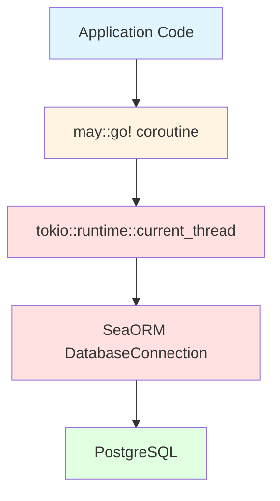

*The beautiful, terrible bridge we built. Notice all the red? That's the async runtime we're trying to avoid.*

We created a `DbPoolManager` that would spawn worker coroutines. Each worker would:
- Create its own Tokio runtime
- Connect to the database via SeaORM
- Wait for jobs on a channel
- Execute queries in the Tokio runtime
- Send results back through another channel

The public API was synchronous (coroutine-friendly), but underneath we were running async code. It was a bridge. A beautiful, terrible bridge.

### Initial Success (The Calm Before the Storm)

And you know what? It worked. It compiled. It ran. We could query the database. We wrote tests. They passed. We high-fived. We thought we were geniuses.

"We did it!" we said. "We bridged async and coroutines!"

Oh, how naive we were.

### The Cracks Appear

The first sign that something was wrong came when we ran benchmarks. The performance was... fine. Not great. Not terrible. Just fine.

But we were using coroutines specifically for performance. "Fine" wasn't good enough.

Then we started noticing other issues:

**Memory Overhead:** We were still allocating futures. Still using async state machines. The coroutines were helping, but we were paying the async tax anyway.

**Complexity:** We were managing two concurrency models. Coroutines for the application layer. Tokio for the database layer. Channels everywhere. It was getting messy.

**Type System Friction:** SeaORM's types require `Send + Sync`. Coroutines aren't `Send + Sync` (they run on user-space stacks). We had to work around this constantly.

**The Double Indirection:** Every query went: Coroutine → Channel → Tokio Runtime → SeaORM → Database and back. That's a lot of layers. A lot of overhead.

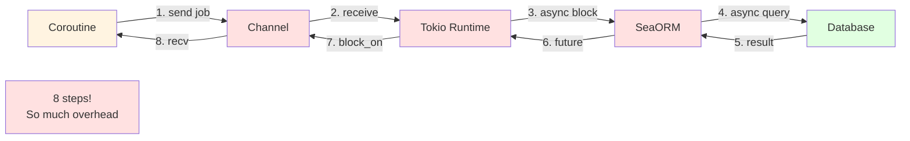

### The Realization

After weeks of this, we had a moment of clarity: **We weren't getting the benefits of coroutines.**

We were using coroutines, yes. But we were still running async code underneath. We were still paying the async tax. We were still dealing with async complexity. We had all the downsides of both approaches and the benefits of neither.

The wrapper wasn't a solution. It was a band-aid. A very elaborate, very complex band-aid that didn't actually solve the problem.

We had built a bridge between two incompatible worlds, and we were the only foolish ones crossing it. And the toll was expensive.

---

## Part 3: Hitting the Brick Wall (Or: Why Async and Coroutines Don't Mix)

### The Fundamental Problem

Let me explain why our wrapper approach was doomed from the start. This is important, because understanding this will save you from making the same mistake on some other misadventure one day.

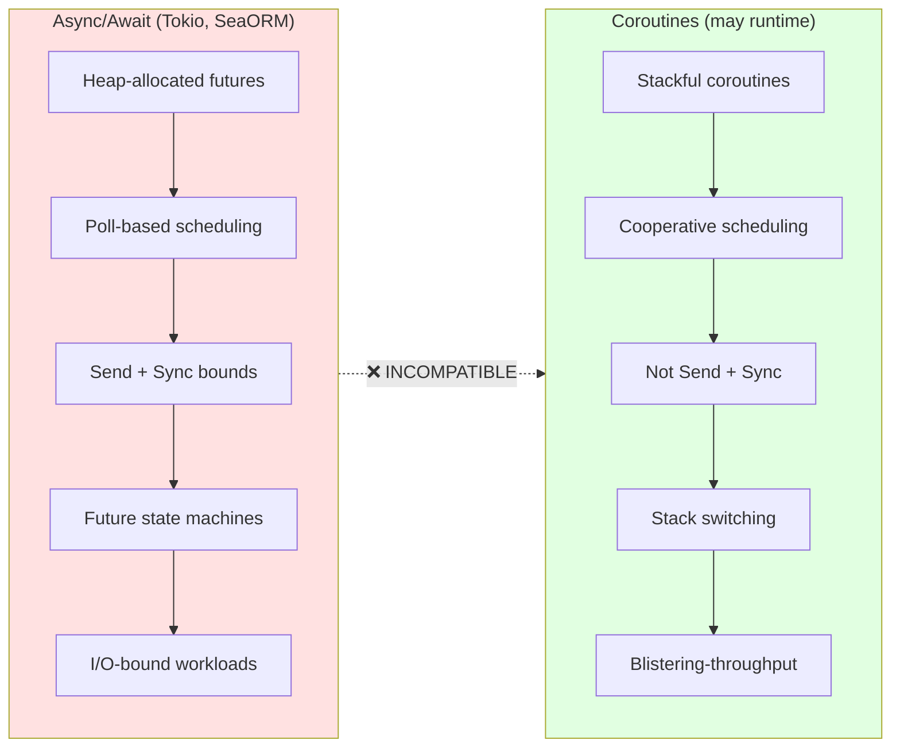

**Async/await (Tokio, SeaORM):**
- Uses heap-allocated futures
- Poll-based scheduling (the runtime polls futures to see if they're ready)
- Requires `Send + Sync` bounds (futures can move between threads)
- Context switching via future state machine transitions
- Designed for I/O-bound workloads

**Coroutines (`may` runtime):**
- Uses stackful coroutines (user-space stacks, like threads but lighter)
- Cooperative scheduling (coroutines yield control explicitly)
- Not `Send + Sync` (coroutines are tied to their stack, can't move between threads)
- Context switching via stack switching (much faster than future polling)
- Designed for blistering high-throughput, predictable latency

These are fundamentally incompatible. You can't just "make async work in coroutines" because:

1. **Futures need a runtime to poll them.** Coroutines don't have a runtime that polls—they yield cooperatively.
2. **Async traits require `Send + Sync`.** Coroutines aren't `Send + Sync` because they're tied to their stack.
3. **Future polling is overhead.** The whole point of coroutines is to avoid this overhead.
4. **You can't `await` without an async runtime.** Coroutines don't have one.

### The SeaORM Dependency Chain

SeaORM's entire architecture assumes async:

- `DatabaseConnection` is an async trait
- Every query method is `async fn`
- The connection pool uses async mutexes
- Transaction management is async
- Even the query builder assumes async execution

You literally cannot use SeaORM without an async runtime. It's baked into every layer.

### Our Attempted Workarounds (A Comedy of Errors)

We tried everything. Oh, did we try.

**Workaround 1: "What if we use `block_on`?"**
```rust
// This doesn't work in coroutines
let result = tokio::runtime::Handle::current()
    .block_on(async { db.query().await });
```
Nope. `block_on` requires a Tokio runtime context. Coroutines don't have one.

**Workaround 2: "What if we spawn Tokio in each coroutine?"**
```rust
may::go!(move || {
    let rt = tokio::runtime::Builder::new_current_thread()
        .build()
        .unwrap();
    rt.block_on(async {
        // SeaORM queries here
    });
});
```
This works, but defeats the purpose. We're still running async code. Still paying the async tax. Still not getting coroutine benefits.

**Workaround 3: "What if we use channels to bridge?"**
```rust
// Send job to async worker
channel.send(DbJob::Query(query)).unwrap();
// Wait for result
let result = result_channel.recv().unwrap();
```
This works, but now we have:
- Coroutines spawning async workers
- Channels for communication
- Double indirection
- All the complexity, none of the benefits

Every workaround created more problems. We were building a Rube Goldberg machine just to query a database.

### The Hard Truth

After months of this, we finally admitted it: **You cannot bridge async and coroutines without significant overhead.**

The architectures are fundamentally incompatible. It's like trying to put a diesel engine in an electric car. Sure, you can do it, but you lose all the benefits of both.

Wrapping SeaORM in coroutines is like:
- Putting a band-aid on a broken leg
- Using a screwdriver as a hammer
- Trying to fit a square peg in a round hole (and then building an elaborate adapter that makes it work, but badly)

We had spent 6 months building an elaborate wrapper that didn't actually solve the problem. We had proven that you *can* make async ORMs work with coroutines, but you *shouldn't*.

### The Decision Point

So we had a choice:
1. Continue with the wrapper (accept the overhead, complexity, and lack of benefits)
2. Use raw SQL (lose type safety, migrations, and all ORM benefits)
3. Start over (build a coroutine-native ORM from scratch)

We chose option 3. Because apparently we're masochists.

But also because it was the only real solution.

---

## Part 4: The Dark Night of the Soul (Or: Months of Mulling Over the Right Approach)

### The Pause

We stopped coding. We stepped back. We asked ourselves: "What are we actually trying to build?"

This was important. We had been so focused on making SeaORM work that we lost sight of the goal. We weren't trying to use SeaORM. We were trying to access a database from coroutines.

Those are different problems.

### Exploring Options

We spent weeks researching alternatives. Here's what we found:

**Option 1: Use Raw SQL**
- Pros: Works with coroutines, no async overhead
- Cons: No type safety, no migrations, no abstractions, just pain
- Verdict: Not viable for a production system

**Option 2: Build a Minimal Query Builder**
- Pros: Lightweight, coroutine-native
- Cons: Still reinventing the wheel, missing ORM features
- Verdict: Better, but incomplete

**Option 3: Fork SeaORM**
- Pros: Start with existing codebase
- Cons: Massive undertaking, maintenance burden, still async underneath
- Verdict: Not a real solution

**Option 4: Build from Scratch**
- Pros: Complete control, coroutine-native from the ground up
- Cons: Many months of work, greenfield development
- Verdict: The only real option

### The Discovery: may_postgres

Then we found it: [`may_postgres`](https://github.com/Xudong-Huang/may_postgres).

A coroutine-native Postgres client. Ported from `rust-postgres` specifically for stackful coroutines. No async runtime. No Tokio. Just pure coroutine I/O.

This was our foundation. This was what we needed and it had been staring us in the face the whole time. Just sitting there, quietly maintained by Xudong Huang.

It's not as popular as `rust-postgres` (9 stars vs. thousands), but it's actively maintained, and it's exactly what we needed: a database client that works natively with coroutines.

### The "Beg, Borrow, Steal" Strategy

With `may_postgres` as our foundation, we could finally think clearly about what to build and what to borrow.

**What We Can Borrow (Compatible Components):**

- **SeaQuery** - SQL builder library. It's runtime-agnostic. It just builds SQL strings. We can use it.
- **SeaORM Migration Patterns** - The DSL for migrations. The concepts, not the runtime. We can borrow the patterns.
- **Configuration Patterns** - We already have this working.
- **Metrics Patterns** - OpenTelemetry integration. Already done.

**What We Must Build (Custom Implementation):**

- **LifeExecutor** - Trait wrapping `may_postgres::Client`
- **LifeModel** - Immutable database row representation (derive macro)
- **LifeRecord** - Mutable insert/update builder (derive macro)
- **LifeMigration** - Migration system (borrowing SeaORM patterns, not runtime)
- **LifeguardPool** - Connection pool using `may_postgres` connections
- **LifeQuery** - Query builder facade over SeaQuery
- **LifeReflector** - Transparent caching layer (Redis + PostgreSQL) coherence system...The money shot!

### The Vision Takes Shape

And that's when it clicked. We weren't building a wrapper. We weren't building a minimal query builder. We were building a **complete ORM**.

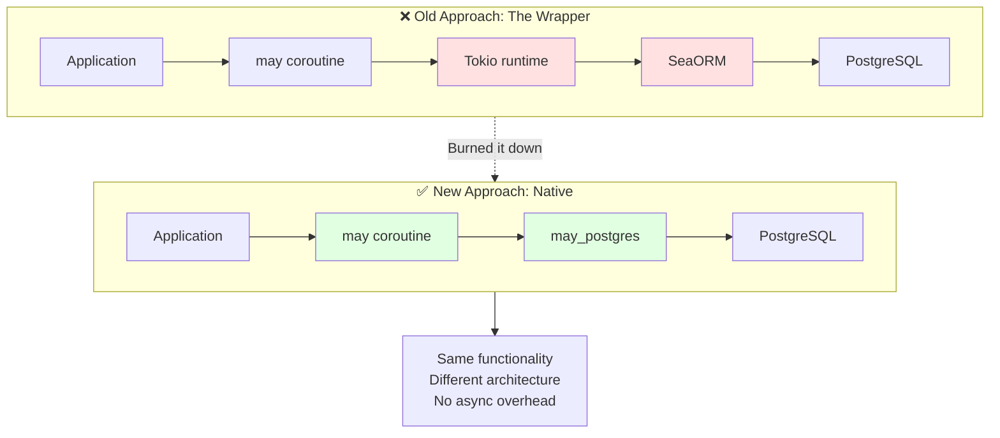

A "parallel universe ORM." Same functionality as SeaORM, but designed from the ground up for coroutines. No async runtime. No Tokio. Just pure coroutine-native database access.

It was ambitious. It was "bonkers." But it was also the only real solution.

We had spent months trying to make incompatible things work together. Now we were going to build something that was designed correctly from the start.

The "bonkers" idea became the only viable path.

---

## Part 5: The New Approach (Or: How We're Actually Going to Build This)

### The Architecture

So here's what we're going to build. The architecture is clean, because we're not trying to bridge incompatible systems anymore.

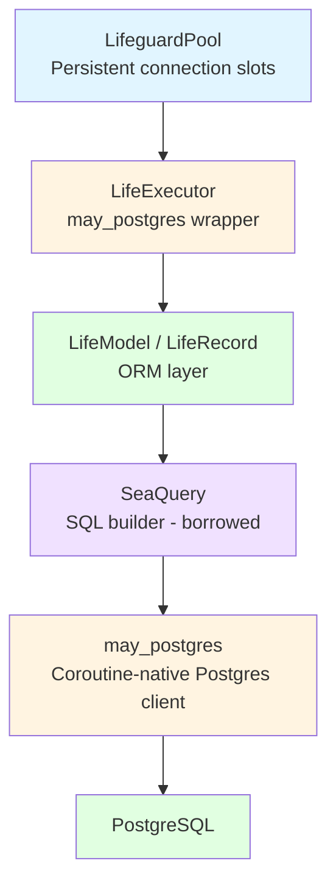

No Tokio. No async runtime. Just coroutines all the way down.

### LifeModel & LifeRecord: The ORM Layer

The core of our ORM is two abstractions:

**LifeModel** - Immutable database rows. This is what you get back from queries.

```rust
#[derive(LifeModel)]
#[table = "users"]
struct User {
    #[primary_key]
    id: i64,
    email: String,
    is_active: bool,
}

// Usage
let user = User::find_by_id(&pool, 1)?;
let users = User::find()
    .filter(User::Email.eq("test@example.com"))
    .all(&pool)?;
```

**LifeRecord** - Mutable change sets. This is what you use for inserts and updates.

```rust
#[derive(LifeRecord)]
struct NewUser {
    email: String,
}

// Usage
let user = NewUser { email: "test@example.com".into() }
    .insert(&pool)?;

let updated = user.to_record()
    .set_email("new@example.com")
    .update(&pool)?;
```

The separation is intentional. LifeModel is immutable (safe to pass around). LifeRecord is for mutations (clear intent, type-safe).

We'll have to build procedural macros to generate all the boilerplate. Just like SeaORM does, but without the async runtime.

### The Connection Pool: LifeguardPool

Here's where we learned from our mistakes. Our first attempt created connections on-demand. That's expensive (2-50ms per connection). Cloud providers limit connections (200-1200 max). Connection churn becomes a bottleneck.

But this isn't just a bottleneck—it's a **catastrophic failure waiting to happen**. With millions of requests per second and only 100-500 connections available, creating connections on-demand means you'll exhaust your connection limit in seconds. The database will start rejecting connections. Your service will fail.

So LifeguardPool does it right:

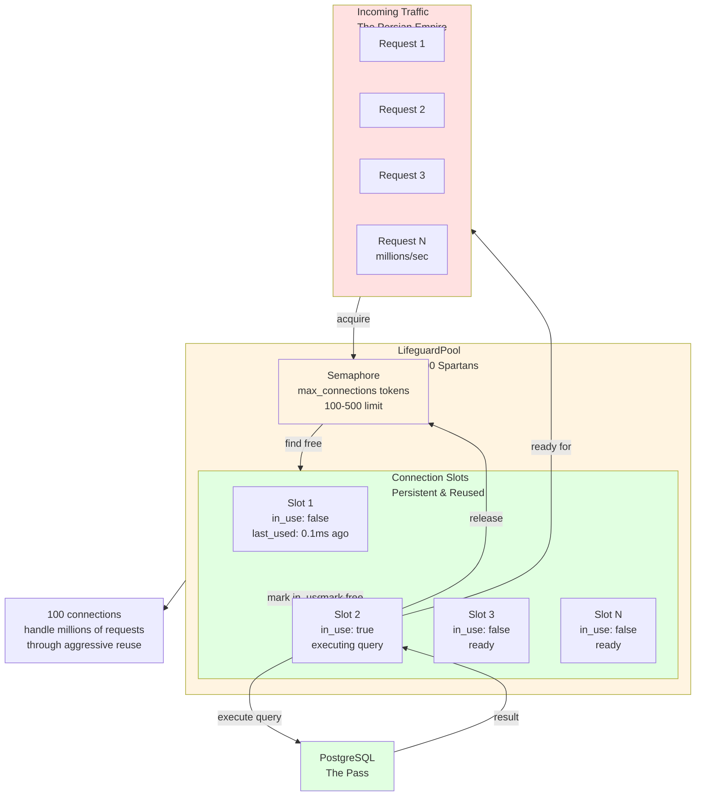

- **Persistent connections:** Pre-allocated, long-lived Postgres connections (the 300 Spartans)
- **Semaphore-based concurrency:** Bounded acquisition prevents connection storms
- **Health monitoring:** Automatic detection and reconnection of failed connections
- **Aggressive reuse:** Connections are reused, not recreated (every connection counts)

This is how connection pools should work. We're not reinventing the wheel here—we're just making sure the wheel is round. And for this design is the difference between handling millions of requests per second and catastrophic failure.

The 100 connections (Spartans) hold the pass (PostgreSQL) against millions of requests (Persian Empire) through superior tactics (connection pooling).

### The Migration System: LifeMigration

We're borrowing SeaORM's migration DSL patterns. The concepts are good. The runtime is the problem.

```rust
pub struct CreateUsers;

impl LifeMigration for CreateUsers {
    fn up(&self, exec: &impl LifeExecutor) -> Result<()> {
        let stmt = Table::create()
            .table(Alias::new("users"))
            .if_not_exists()
            .col(ColumnDef::new(Alias::new("id"))
                .big_integer()
                .not_null()
                .primary_key())
            .col(ColumnDef::new(Alias::new("email"))
                .string()
                .not_null())
            .to_string(PostgresQueryBuilder);

        exec.execute(&stmt, &[])?;
        Ok(())
    }

    fn down(&self, exec: &impl LifeExecutor) -> Result<()> {
        exec.execute("DROP TABLE IF EXISTS users", &[])?;
        Ok(())
    }

    fn name(&self) -> &'static str {
        "20250101_create_users"
    }
}
```

Same DSL. Same concepts. But synchronous. Coroutine-native. No async runtime.

### The Killer Feature: LifeReflector

This is where it gets interesting. We're not just building an ORM. We're building a **distributed cache coherence system**.

**The Problem:** Microservices need caching (Redis) for performance. But maintaining cache consistency across multiple services is notoriously difficult. You either:
- Manually invalidate caches (error-prone, complex)
- Use TTL-based expiration (stale data, cache misses)
- Build event-driven invalidation (complex infrastructure)

**But this isn't just a nice-to-have. It's a requirement for survival.**

With workload scenarios of **50,000 concurrent users** and **millions of requests per second**, you can't afford to hit PostgreSQL for every read. You need Redis caching. But with multiple microservices, you need cache coherence. Without it:
- **Cache stampedes:** Multiple services invalidate the same key simultaneously
- **Stale data:** One service updates data, others read stale cached values
- **Thundering herd:** Cache miss causes thousands of simultaneous database queries
- **Connection exhaustion:** Cache misses overwhelm your 100-1200 connection limit

At scale, a single cache coherence failure can cascade into a complete system failure. The Persian Empire (traffic) overwhelms the 300 Spartans (connections).

**The Solution: LifeReflector**

A standalone microservice that maintains cluster-wide cache coherence:

- **Leader-elected Raft system:** Only one active reflector at a time (no duplicate work)
- **Postgres LISTEN/NOTIFY integration:** Subscribes to database change events
- **Intelligent cache refresh:** Creates or updates keys in Redis (TTL-based active set)
- **Zero-stale reads:** Redis always reflects current database state
- **Horizontal scaling:** All microservices benefit from single reflector
- **Prevents cache stampedes:** Single source of truth for cache invalidation
- **Eliminates thundering herd:** Coordinated cache refresh prevents simultaneous queries

**How It Works:**

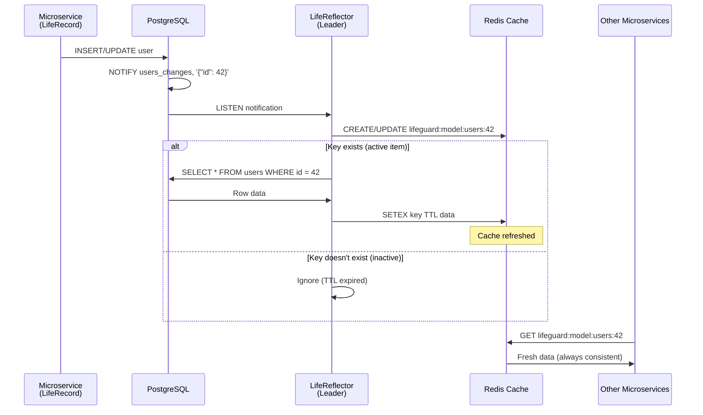

1. LifeRecord writes to Postgres → triggers `NOTIFY users_changes, '{"id": 42}'`
2. LifeReflector (leader) receives notification
3. Checks if `lifeguard:model:users:42` exists in Redis (active item)
4. If exists → refreshes from database → updates Redis
5. If not → ignores (inactive item, TTL expired)
6. All microservices read from Redis → always fresh data

This is enterprise level Coherence-level functionality, but:
- Lighter (no JVM, no enterprise licensing)
- Faster (coroutine-native, no async overhead)
- Simpler (TTL-based active set, no manual invalidation)
- Open source

**Why LifeReflector Matters:**

At **millions of requests per second**, cache coherence isn't optional. It's the difference between:
- **With LifeReflector:** 99%+ cache hit rate, sub-millisecond reads, 100 connections handle millions of requests
- **Without LifeReflector:** Cache stampedes, stale data, thundering herd, connection exhaustion, system failure

Here's the math:
- **50,000 concurrent users** × **20 requests/second/user** = **1,000,000 requests/second**
- **Without caching:** 1,000,000 requests/second × 1ms database query = **1,000 seconds of database time per second** (impossible)
- **With caching (95% hit rate):** 50,000 cache misses/second × 1ms = **50 seconds of database time per second** (still impossible with 100 connections)
- **With LifeReflector (99%+ hit rate):** 10,000 cache misses/second × 1ms = **10 seconds of database time per second** (100 connections can handle ~100 queries/second each = 10,000 total)

LifeReflector makes the impossible possible. It's not just cache coherence. It's **survival at scale**.

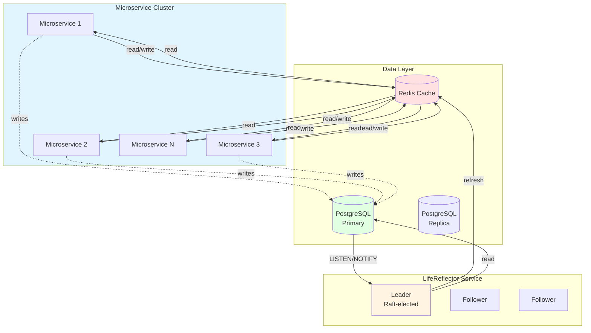

We're calling it our "killer feature" because it solves a problem that most ORMs don't even try to solve. It's not just a feature, it's the architecture that makes extreme scale possible.

**The Pricewhisperers Cache Coherence Challenge:**

Imagine this scenario:
1. **Service A** updates their record (microservice 1 writes to PostgreSQL)
2. **Service B** reads Service A's record (microservice 2 reads from Redis—stale data!)
3. **Service C** reads Service A's record (microservice 3 reads from Redis—stale data!)
4. **Service D** reads Service A's record (microservice 4 reads from Redis—stale data!)

Without LifeReflector, you have two options:
- **Option 1:** Invalidate cache on write (cache stampede—all microservices try to refresh simultaneously)
- **Option 2:** Use TTL expiration (stale data for up to TTL duration)

Both options fail at scale. Cache stampedes exhaust your 100-500 connections. Stale data breaks user experience.

**With LifeReflector:**
1. **User A** updates their profile (microservice 1 writes to PostgreSQL)
2. **PostgreSQL** sends `NOTIFY users_changes, '{"id": 42}'`
3. **LifeReflector** (single leader) receives notification
4. **LifeReflector** checks if `lifeguard:model:users:42` exists in Redis
5. **LifeReflector** fetches fresh data from PostgreSQL (single query, not thousands)
6. **LifeReflector** updates Redis with fresh data
7. **All microservices** read fresh data from Redis (zero database queries)

One write. One database query for cache refresh. Millions of reads from Redis. The 100 connections (Spartans) defeat the Persian Empire (traffic) through superior cache coherence tactics.

This is why LifeReflector is critical. It's not just about performance. It's about **architectural survival** at absurd scale.

### Replica Read Support

We're also building intelligent read routing with WAL lag awareness:

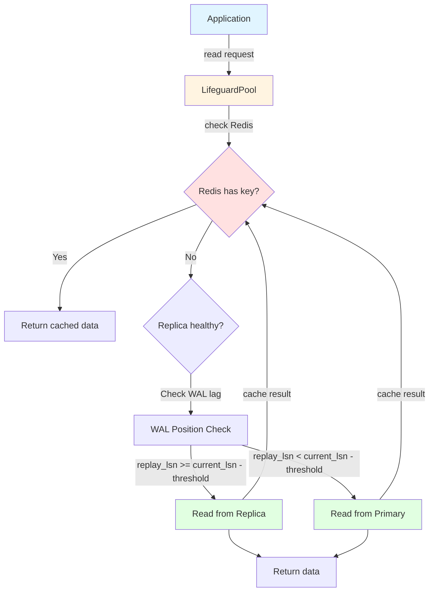

- **WAL position tracking:** Monitors `pg_current_wal_lsn()` vs `pg_last_wal_replay_lsn()`
- **Dynamic health checks:** Automatically detects replica lag
- **Intelligent routing:** Routes reads to replicas only when healthy
- **Automatic fallback:** Falls back to primary if replicas are stale
- **Strong consistency mode:** Optional causal read-your-writes consistency

This is interstellar grade stuff. The kind of thing that separates a toy from a real system.

---

## Part 6: Why This Matters (Or: The Impact)

### Performance Benefits

Let's talk numbers. We don't have final benchmarks yet (we're still building), but based on the architecture:

- **2-5× faster than async ORMs** on hot paths (no future polling overhead)
- **10×+ faster on small queries** (no future allocation overhead)
- **Predictable p99 latency** (deterministic coroutine scheduling)
- **Lower memory footprint** (stackful coroutines vs. heap-allocated futures)

These aren't theoretical benefits. These are real performance gains from using the right concurrency model for the job.

**For BRRTRouter:**
- At 100,000 requests per second, even a 0.1ms improvement matters
- Sub-millisecond database access means we can maintain our p99 < 25ms target
- Lower memory footprint means more concurrent connections
- Predictable latency means consistent performance under load

**For rerp:**
- Fast database access means instant inventory updates
- Financial calculations complete in milliseconds, not seconds
- Reporting queries finish quickly (users won't wait)
- The entire ERP system feels fast and responsive

**For Pricewhisperer:**
- **50,000 concurrent users** generating millions of requests per second
- Only **100-1200 database connections** available (cloud provider limits)
- Connection pooling is **survival at scale**, not optimization
- Every connection pool must handle thousands of requests per second
- Aggressive connection reuse is the difference between success and failure
- The 100 connections (Spartans) must defeat the Persian Empire (traffic)
- **LifeReflector cache coherence** prevents cache stampedes and thundering herd
- **99%+ cache hit rate** means 100 connections can handle millions of requests
- **Zero-stale reads** ensure data consistency across all microservices
- **TTL-based active set** means only active users consume cache resources

**The PostgreSQL Advantage:**
- PostgreSQL is already fast—we just need a fast way to talk to it
- No async overhead means we get closer to raw PostgreSQL performance
- Coroutine-native I/O means we're not fighting the database
- We're building a blistering fast bridge to the wonder of database systems
- Connection pooling and practically magical caching makes limited connections handle unlimited scale

### Architectural Alignment

Lifeguard fits perfectly with both BRRTRouter and rerp. All three use coroutines. All three are designed for high throughput. All three prioritize predictable latency.

**BRRTRouter Integration:**
- API router handling 100,000+ requests per second
- Needs sub-millisecond database access for authentication, routing, rate limiting
- Lifeguard provides the fast database bridge it needs
- Unified coroutine model across the entire stack

**rerp Integration:**
- Opensource ERP system with complex database operations
- Needs fast access for inventory, financial, manufacturing modules
- Lifeguard provides type-safe ORM with PostgreSQL feature support
- LifeReflector ensures cache coherence across microservices
- Perfect for modular architecture where each module needs database access

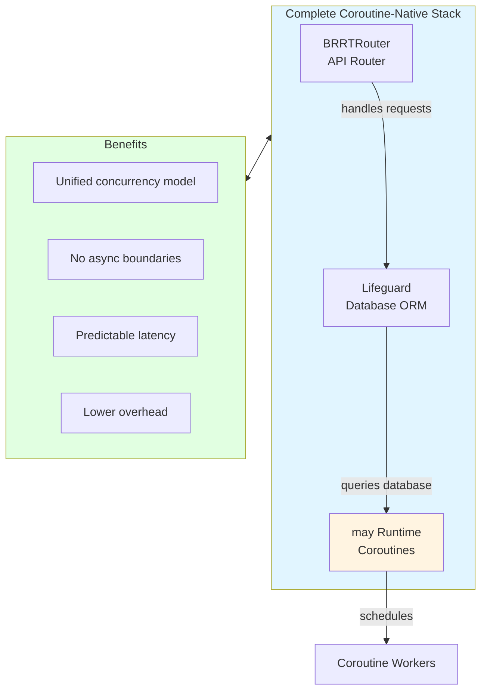

There's no async/await boundary. No context switching between concurrency models. Just clean, unified execution.

This matters. When your entire stack uses the same concurrency model, everything is simpler. Easier to reason about. Easier to debug. Easier to optimize.

### Unique Features

LifeReflector alone is worth the effort. Distributed cache coherence is hard. Most systems don't even try. We're building it in.

Replica read support with WAL lag awareness will relieve Postgresql Master node. Most ORMs don't handle this. We will.

Complete PostgreSQL feature support. Views, materialized views, JSONB, full-text search, PostGIS, partitioning. We're building it all.

### Developer Experience

The API is familiar. If you know SeaORM, you'll feel at home with Lifeguard. But without the async complexity.

```rust
// No async/await needed
let user = User::find_by_id(&pool, 1)?;
let users = User::find()
    .filter(User::Email.eq("test@example.com"))
    .all(&pool)?;
```

Type-safe queries. Compile-time validation. Clear error messages. Complete tooling.

It's the ORM experience you want, but built for coroutines.

### The Ecosystem Impact

We're building the first coroutine-native ORM for Rust. That's significant.

**For BRRTRouter:**
- Enables high-performance API routing with database-backed features
- Authentication, rate limiting, routing rules—all need fast database access
- Lifeguard provides the performance foundation BRRTRouter needs

**For rerp:**
- Enables modular ERP architecture with fast database access
- Each module (CRM, Sales, Inventory, Financial) needs its own database layer
- Lifeguard provides the ORM foundation rerp needs
- LifeReflector ensures cache coherence across ERP microservices

**For Pricewhisperer:**
- Enables extreme scale: 50,000 concurrent users, millions of requests per second
- Connection pooling makes 100-500 connections handle unlimited traffic
- The 100 connections (Spartans) defeat the Persian Empire (traffic) through superior architecture
- Lifeguard provides the connection efficiency Pricewhisperers needs to survive at scale
- **LifeReflector provides cache coherence** that prevents cache stampedes and thundering herd
- **99%+ cache hit rate** means Redis handles most reads, PostgreSQL handles only writes and cache misses
- **TTL-based active set** means only active users consume cache resources (inactive users' data expires)
- **Zero-stale reads** ensure all microservices see consistent data
- This is where connection pooling and cache coherence become a matter of survival, not optimization

**For the Ecosystem:**
- Enables a new class of high-performance services
- Provides a foundation for coroutine-based tools
- Reference implementation for coroutine-native database access
- Proves that coroutines can be a viable alternative to async/await
- Shows that limited database connections can handle unlimited scale through proper pooling

If coroutines are going to succeed in Rust, they need proper database access. We're building that. And we're building 
it for systems that need blistering fast access to PostgreSQL—the wonder of database systems. Systems like BRRTRouter, 
rerp, and Pricewhisperer, where performance and scale requirements are not just important they border on the **absurd**.

---

## Part 7: The Road Ahead (Or: The Plan)

### The Phases

We've broken this down into phases because, let's be honest, this is a lot of work.

**Phase 1: Foundation (Weeks 1-3)**
- Remove SeaORM and Tokio dependencies
- Integrate `may_postgres` as database client
- Implement `LifeExecutor` trait
- Redesign `LifeguardPool` for `may_postgres`
- Basic metrics and observability

**Phase 2: ORM Core (Weeks 3-6)**
- Build `LifeModel` derive macro
- Build `LifeRecord` derive macro
- Implement basic CRUD operations
- Integrate SeaQuery for SQL building
- Type-safe query builders

**Phase 3: Migrations (Weeks 6-8)**
- Implement `LifeMigration` trait
- Build migration runner
- Create CLI tooling (`lifeguard migrate`)
- Support core PostgreSQL features

**Phase 4: v1 Release (Weeks 8-10)**
- Complete PostgreSQL feature support
- Testkit infrastructure
- Comprehensive documentation
- Integration with BRRTRouter
- Performance benchmarks

**Phase 5: Advanced Features (Weeks 10-14)**
- **LifeReflector (distributed cache coherence)** - Critical for use at scale
  - Leader-elected Raft system
  - PostgreSQL LISTEN/NOTIFY integration
  - Redis cache coherence with TTL-based active set
  - Prevents cache stampedes and thundering herd at millions of requests/second
  - Enables 99%+ cache hit rate with zero-stale reads
  - Integration testing with early adopts "at scale" requirements
- Redis integration
- Replica read support with WAL lag awareness
- Relation loading
- Materialized views, generated columns

**Phase 6: Enterprise Features (Quarter 3)**
- PostGIS support
- Partitioning
- Triggers and stored procedures
- Schema introspection tools
- Code generation from database, this feeds back into the controller side of BRRTRouter.

### The Challenges

Let's be honest about what we're up against:

- **Greenfield development:** 6-12 months for v1. This is a lot of code.
- **Small ecosystem:** `may` is less popular than Tokio. Less documentation. Fewer examples.
- **Maintenance burden:** A complete ORM is significant ongoing work.
- **Risk:** What if `may` becomes obsolete? What if async Rust wins completely?

These are real concerns. We're not ignoring them.

### Why We're Doing It Anyway

But here's why we're doing it anyway:

1. **The problem is real.** Coroutines need database access. The gap exists.
2. **The architecture is sound.** We're not guessing. We know what we're building.
3. **The opportunity is unique.** Near realtime DB access for coroutine-native ORM space.
4. **The alternative is worse.** Continue with wrappers? Use raw SQL? Neither is viable.
5. **The vision is compelling.** High-performance, predictable, ORM familiarity.

We're not building this because it's easy. We're building it because it's necessary.

### The Call to Action

So here's where we are: We've learned from our mistakes. We've found the right foundation. We have a clear plan.

We're building Lifeguard. A complete ORM for Rust coroutines. A parallel universe to SeaORM, but designed correctly from the start.

If you're interested, follow along. If you want to contribute, we'd love the help. If you want to use it, it'll be ready when it's ready.

This is a journey. A bonkers, ambitious, probably-foolish journey. But it's the right journey.

---

## Part 8: Conclusion (Or: The Reflection)

### What We Learned

We learned a lot from our spectacular failure. Here are the key takeaways:

1. **You can't force incompatible architectures together.** Async and coroutines don't mix. No amount of wrapping will fix that.

2. **Sometimes you need to start over.** We spent months on a wrapper that didn't work. Starting over was the right call.

3. **The "bonkers" idea might be the only viable path.** Building a complete ORM from scratch sounds crazy. But it's the only real solution.

4. **Building from scratch is hard, but necessary.** We're not taking the easy path. We're taking the right path.

### The Bigger Picture

Rust's database ecosystem is dominated by async/await. That's fine. Async/await is great for many use cases.

But coroutines offer something different. Deterministic scheduling. Predictable latency. Lower overhead. These matter for high-throughput systems.

The ecosystem needs diversity. Not everything should be async. Coroutines deserve proper tooling too.

Lifeguard is that tooling. It's the ORM that coroutines need. The ORM that shouldn't need to exist, but does.

### Final Thoughts

We're building something that shouldn't need to exist. But it does need to exist, because the gap is real.

**BRRTRouter** needs it. **rerp** needs it. **Pricewhisperer** needs it. Any high-performance system built on coroutines needs it.

We spent months building a wrapper that didn't work. We hit a brick wall. We burned it all down.

And now we're building an entire ORM from scratch.

Is it bonkers? Yes. Is it necessary? Also yes.

This is the journey. The bonkers, ambitious, probably foolish journey of building a parallel universe ORM for Rust coroutines. A blistering fast bridge to PostgreSQL—the wonder of database systems.

We're doing it for **BRRTRouter**, so it can route 100,000+ requests per second with sub-millisecond database access.

We're doing it for **rerp**, so enterprises can run their entire business on a fast, modular ERP system.

We're doing it for **Pricewhisperer**, where 50,000 concurrent users and millions of requests per second converge on databases with only 100-500 connections available..

We're doing it because sometimes the only way forward is to build what doesn't exist yet.

And we're doing it for you! cause you might want to build your next hair brained idea on  **BRRTRouter** the OpenAPI first framework.

Because PostgreSQL deserves a fast, coroutine-native ORM. And we're the ones building it. For systems where scale requirements are not just high, they're **absurd**.

The 100 men (connections) defeat the Persian Empire (traffic). Through superior architecture.

---

*Follow our journey: [GitHub](https://github.com/microscaler/lifeguard)*

*Have questions? Found this interesting? Want to contribute? We'd love to hear from you.*

---

**About the Author:** Building high-performance systems with Rust coroutines. Learning from spectacular failures. Building the tools that should exist.


