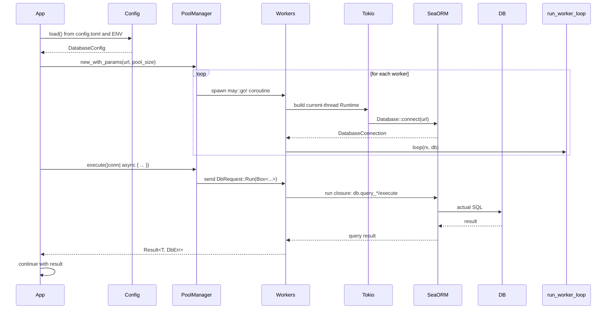
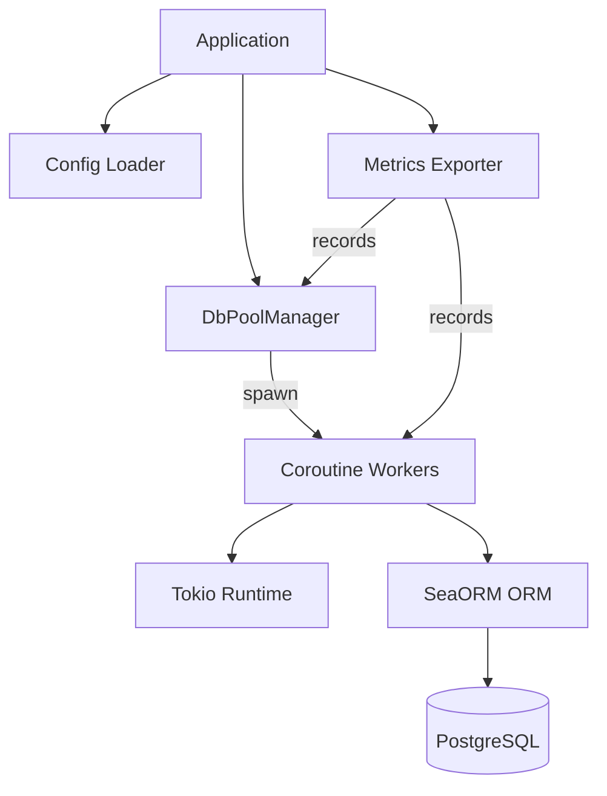
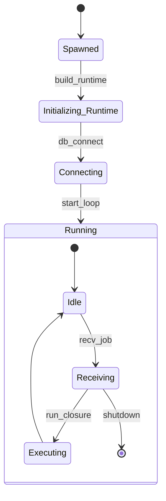
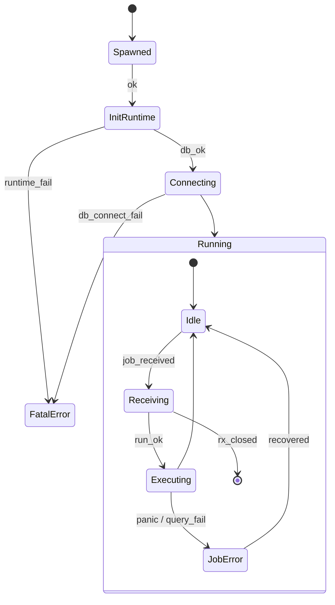
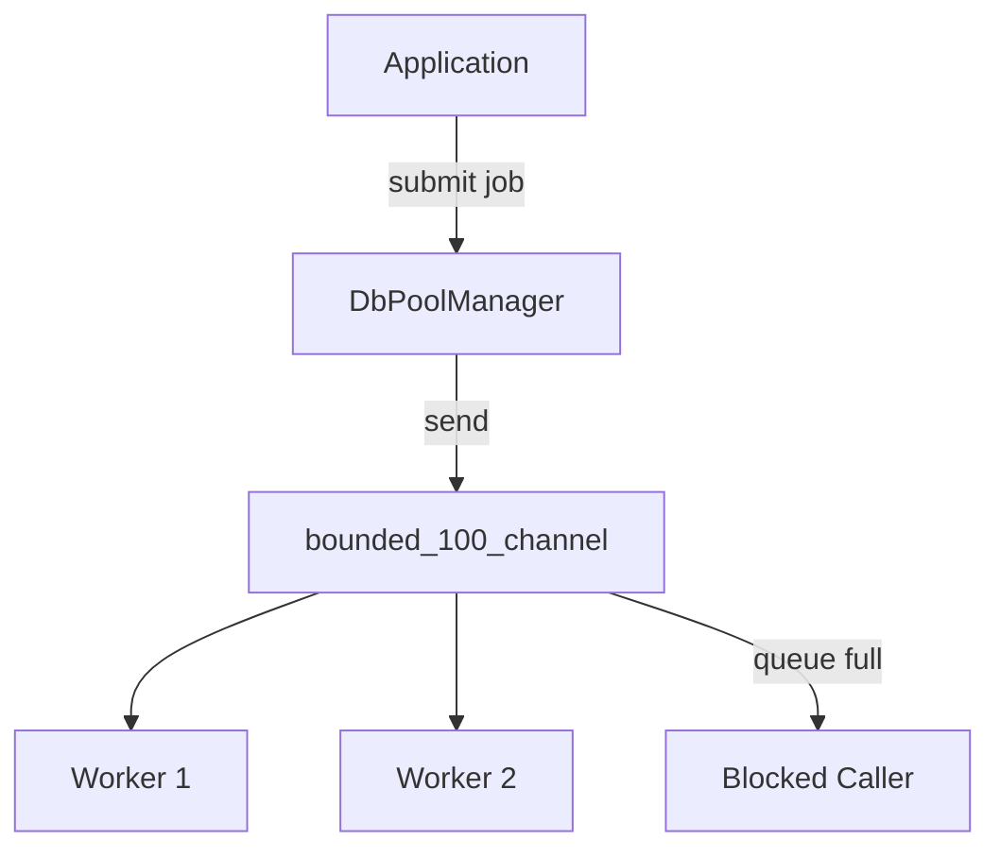
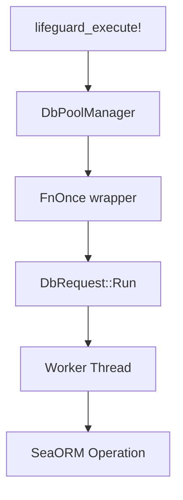

<p align="center">
  
</p>

# 🛟 Lifeguard: Coroutine-Driven Database Runtime for Rust

**Lifeguard** is a coroutine-first, high-performance PostgreSQL connection pool built for Rust using [SeaORM](https://www.sea-ql.org/SeaORM/) and the [may](https://github.com/Xudong-Huang/may) coroutine runtime.

It provides predictable, low-latency execution for async workloads while reducing thread and memory overhead.

---

## 🔥 Why Lifeguard?

- ⚡ Built from scratch using coroutine workers (`may::go!`) for efficiency.
- ✅ No thread-per-connection overhead.
- ✅ Clean task model: one type-safe job per coroutine.
- ✅ Fully typed `execute<T>` method — no `Any`, no boxing.
- ✅ Strong observability: OpenTelemetry + Prometheus support.
- ✅ Designed for concurrency and correctness.

---

## 🏗️ Architecture Overview

```text
┌────────────┐         ┌─────────────────────┐         ┌────────────────────────────┐
│ may::go!   │─────▶──▶  DbPoolManager       │─────▶──▶   SeaORM / raw SQL queries  │
└────────────┘         └─────────────────────┘         └────────────────────────────┘
```

- **DbPoolManager**: distributes tasks to coroutine workers via a bounded channel.
- **Worker Runtimes**: each runs a local tokio runtime and a shared SeaORM `DatabaseConnection`.















---

## 💻 Getting Started

```toml
[dependencies]
lifeguard = { git = "https://github.com/microscaler/lifeguard", branch = "overhaul" }
```

```rust
let config = DatabaseConfig::load()?;
let pool = DbPoolManager::new_with_params(&config.url, config.max_connections)?;

may::go!(move || {
    let users = pool.execute(|db| async move {
        MyEntity::find().all(&db).await
    });
});
```

---

## 📊 Observability

Powered by `opentelemetry` + `opentelemetry-prometheus`.

- `lifeguard_queries_total`
- `lifeguard_query_duration_seconds`
- `lifeguard_coroutine_wait_seconds`
- `lifeguard_pool_queue_depth`

Enable scraping via:
```bash
just metrics-server
```

---

## 🔧 Testing

Lifeguard includes a `test_pool!()` macro that creates a mock connection pool for unit testing with SeaORM’s `MockDatabase`.

```rust
let pool = test_pool!();
```

---

## 🚀 Roadmap to Alpha Release

### ✅ Implemented
- [x] Coroutine-backed worker pool
- [x] `execute<T>` dispatch method
- [x] Fully typed `DbRequest` with closure-based jobs
- [x] OpenTelemetry metrics instrumentation
- [x] Configuration from TOML + env
- [x] Entity CRUD tests
- [x] Transaction rollback validation
- [x] Concurrent task handling
- [x] Retry loop simulation

### 🧩 To Implement
- [ ] Tracing integration via `tracing::instrument`
- [ ] Expose `/metrics` via HTTP
- [ ] Retry policies with exponential backoff
- [ ] Graceful shutdown signal to worker loop
- [ ] Macros for `lifeguard_execute!`, `lifeguard_txn!`
- [ ] CLI: metrics reporter or local benchmark runner
- [ ] Dashboards for Grafana

---

## 📜 License

Licensed under Apache-2.0.
