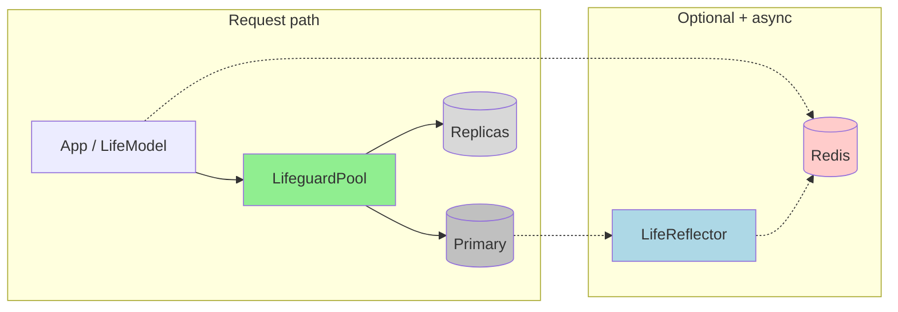

<p align="center">
  <a href="https://github.com/microscaler/lifeguard/actions/workflows/ci.yaml?query=branch%3Amain"></a>
  &nbsp;
  <a href="https://github.com/microscaler/lifeguard/blob/main/.github/workflows/ci.yaml"></a>
</p>
<p align="center">
  
</p>

# 🛟 Lifeguard: Coroutine-Driven Database Runtime for Rust

**Lifeguard** is a **coroutine-native PostgreSQL ORM and data access platform** built for Rust's `may` runtime. It aims for SeaORM-like ergonomics without async/`Tokio`: stackful coroutines and `may_postgres` as the database client.

## Why Lifeguard (technical bet)

**The problem:** Existing Rust ORMs (SeaORM, Diesel, SQLx) target async/`Tokio`. The `may` coroutine runtime uses stackful coroutines, not async futures—**architectures do not bridge** without significant cost. For the narrative on that mismatch and the pain of forcing async ORMs onto a coroutine stack, see **[LIFEGUARD_BLOG_POST.md](./LIFEGUARD_BLOG_POST.md)**.

**The approach:** A full ORM on **`may_postgres`** (coroutine-native PostgreSQL). No async runtime on the database path. Pure coroutine I/O.

**Who it is for:** Teams on **`may`** (for example **BRRTRouter**) who want **SeaORM-like** productivity, **typed models and queries**, a **production connection pool** (primary/replica, WAL-aware routing, optional read preference), **OTel-compatible** metrics/tracing, and a **cache-coherence** story (**LifeReflector** + Redis) aimed at **latency-sensitive** tiers.

**Shipped vs aspirational:** Treat **[COMPARISON.md](./COMPARISON.md#repository-status)** (repository truth), `cargo doc`, and `examples/` as **source of truth**; some diagrams and marketing copy still describe **target** behavior (for example fully automatic transparent Redis on every read path). Product vision, feature lists, and the LifeReflector narrative: **[VISION.md](./VISION.md)**. Parity tables and competitive framing: **[COMPARISON.md](./COMPARISON.md)** and the [SeaORM mapping](./docs/planning/lifeguard-derive/SEAORM_LIFEGUARD_MAPPING.md).

---

## 🏗️ Architecture overview

High-level data flow: your app and ORM go through **`LifeguardPool`** to **PostgreSQL** (writes and strong reads on the **primary**; scaled reads may use **replicas** when routing allows). **Redis** is optional cache-aside; **[`lifeguard-reflector`](./lifeguard-reflector/)** refreshes warm keys **asynchronously** after commits (not on the `SELECT` hot path).


```mermaid
flowchart LR
    subgraph Req["Request path"]
        A[App / LifeModel] --> P[LifeguardPool]
        P --> PR[(Primary)]
        P --> RP[(Replicas)]
    end
    subgraph Opt["Optional + async"]
        A -.-> R[(Redis)]
        PR -.-> LR[LifeReflector]
        LR -.-> R
    end
    style PR fill:#c0c0c0
    style RP fill:#d8d8d8
    style R fill:#ffcccb
    style LR fill:#add8e6
    style P fill:#90ee90
```

**Full diagrams** (numbered call order, multi-service deployment, pool slots, LifeReflector sequence): **[ARCHITECTURE.md](./ARCHITECTURE.md)**.

---

## 💻 Getting started

### Installation

```toml
[dependencies]
lifeguard = { git = "https://github.com/microscaler/lifeguard" }
lifeguard-derive = { git = "https://github.com/microscaler/lifeguard", package = "lifeguard-derive" }
```

Enable optional features as needed, for example `metrics`, `tracing`, or `graphql` (see root `Cargo.toml`).

### Usage (today)

1. **Direct client:** connect with `lifeguard::connect` and wrap the client in `MayPostgresExecutor`.
2. **Pooled:** build a [`LifeguardPool`](./src/pool/pooled.rs) (`new`, `new_with_settings`, or `from_database_config`) and use [`PooledLifeExecutor`](./src/pool/pooled.rs) for `LifeExecutor` traffic (see `cargo doc` on `lifeguard::pool`).
3. Define entities with `#[derive(LifeModel, LifeRecord)]` and `#[table_name = "..."]` (see [`lifeguard-derive/tests/test_minimal.rs`](./lifeguard-derive/tests/test_minimal.rs)).
4. Build queries with `SelectQuery` and related APIs; see [`examples/query_builder_example.rs`](./examples/query_builder_example.rs).

Pooling behavior and tunables evolve with [PRD_CONNECTION_POOLING.md](./docs/planning/PRD_CONNECTION_POOLING.md); prefer **rustdoc** for the exact public API at your revision.

### Developer workflow

- **[DEVELOPMENT.md](./DEVELOPMENT.md)** — Clippy (CI parity), pre-commit, `just` recipes.
- **[docs/TEST_INFRASTRUCTURE.md](./docs/TEST_INFRASTRUCTURE.md)** — Postgres/Redis for integration tests and CI.

---

## 📊 Observability

Lifeguard is **OpenTelemetry-compatible**: optional **`tracing`** spans/events and optional **Prometheus** metrics (`metrics` / `tracing` features) fit standard **OTLP** pipelines—use them with **OpenTelemetry-native** backends (Grafana, Jaeger, Tempo, collectors) or **Datadog** via OTLP intake or the Datadog Agent’s OpenTelemetry support. Lifeguard does not install global OTel or `tracing` subscribers for you; the host app owns **one** provider and subscriber (see **[OBSERVABILITY.md](./OBSERVABILITY.md)** and **[docs/OBSERVABILITY_APP_INTEGRATION.md](./docs/OBSERVABILITY_APP_INTEGRATION.md)**).

**Details:** Prometheus series (pool, queries, replica lag), tracing scopes, LifeReflector metrics, and **Kind/Tilt** dashboard refresh — **[OBSERVABILITY.md](./OBSERVABILITY.md)** (overview) and **[docs/OBSERVABILITY.md](./docs/OBSERVABILITY.md)** (full metric tables, feature flags, `kubectl apply`).

---

## 🧪 Testing

- **Library tests:** `cargo test -p lifeguard`, workspace members (`lifeguard-derive`, `lifeguard-migrate`, etc.), and (when configured) `cargo nextest` per [DEVELOPMENT.md](./DEVELOPMENT.md) / [justfile](./justfile).
- **Integration database:** `lifeguard::test_helpers::TestDatabase` and env vars such as `TEST_DATABASE_URL` — see [docs/TEST_INFRASTRUCTURE.md](./docs/TEST_INFRASTRUCTURE.md).

There is **no** `lifeguard::testkit` / `test_pool!` macro in this repository; use `test_helpers` and the integration-test binaries under `tests/`.

---

## 📚 Documentation

| Topic | Document |
|--------|----------|
| **Repository truth, competitive matrix, ecosystem, performance** | [COMPARISON.md](./COMPARISON.md) |
| **Roadmap (high-level areas)** | [ROADMAP.md](./ROADMAP.md) |
| **Product vision & long-form “what we’re building”** | [VISION.md](./VISION.md) |
| **Blog: async ORMs vs `may`, and why Lifeguard exists** | [LIFEGUARD_BLOG_POST.md](./LIFEGUARD_BLOG_POST.md) |
| **Architecture (diagrams, flows)** | [ARCHITECTURE.md](./ARCHITECTURE.md) |
| **Observability overview (OTel-compatible, Datadog via OTLP)** | [OBSERVABILITY.md](./OBSERVABILITY.md) |
| **Host-owned OTel/tracing wiring** | [docs/OBSERVABILITY_APP_INTEGRATION.md](./docs/OBSERVABILITY_APP_INTEGRATION.md) |
| **Metrics tables, Kind/Tilt `kubectl apply`** | [docs/OBSERVABILITY.md](./docs/OBSERVABILITY.md#kubernetes-kind-tilt-apply-and-refresh-dashboards) |
| **Connection pool operations & tuning** | [docs/POOLING_OPERATIONS.md](./docs/POOLING_OPERATIONS.md) · [docs/planning/DESIGN_CONNECTION_POOLING.md](./docs/planning/DESIGN_CONNECTION_POOLING.md) |
| **SeaORM ↔ Lifeguard mapping (authoritative parity)** | [docs/planning/lifeguard-derive/SEAORM_LIFEGUARD_MAPPING.md](./docs/planning/lifeguard-derive/SEAORM_LIFEGUARD_MAPPING.md) |
| **Developer workflow & Clippy / pre-commit** | [DEVELOPMENT.md](./DEVELOPMENT.md) |
| **Tests & CI Postgres/Redis** | [docs/TEST_INFRASTRUCTURE.md](./docs/TEST_INFRASTRUCTURE.md) |
| **Epic notes & story tree** | [docs/EPICS/](./docs/EPICS/) · [docs/planning/epics-stories/](./docs/planning/epics-stories/) |
| **Planning index** | [docs/planning/README.md](./docs/planning/README.md) |

---

## 🤝 Contributing

Lifeguard is under active development. We welcome:
- 📝 Documentation improvements
- 🐛 Bug reports
- 💡 Feature suggestions
- 🧪 Testing and feedback

See [EPICS](./docs/EPICS/) for current development priorities.

---

## 📜 License

Licensed under **MIT OR Apache-2.0** at your option ([`Cargo.toml`](./Cargo.toml)). The [`LICENSE`](./LICENSE) file in this repository contains the Apache-2.0 text.
