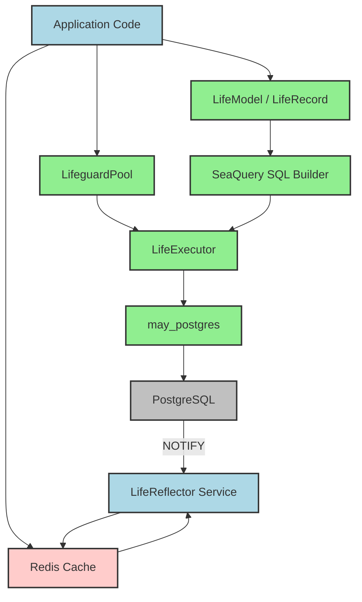
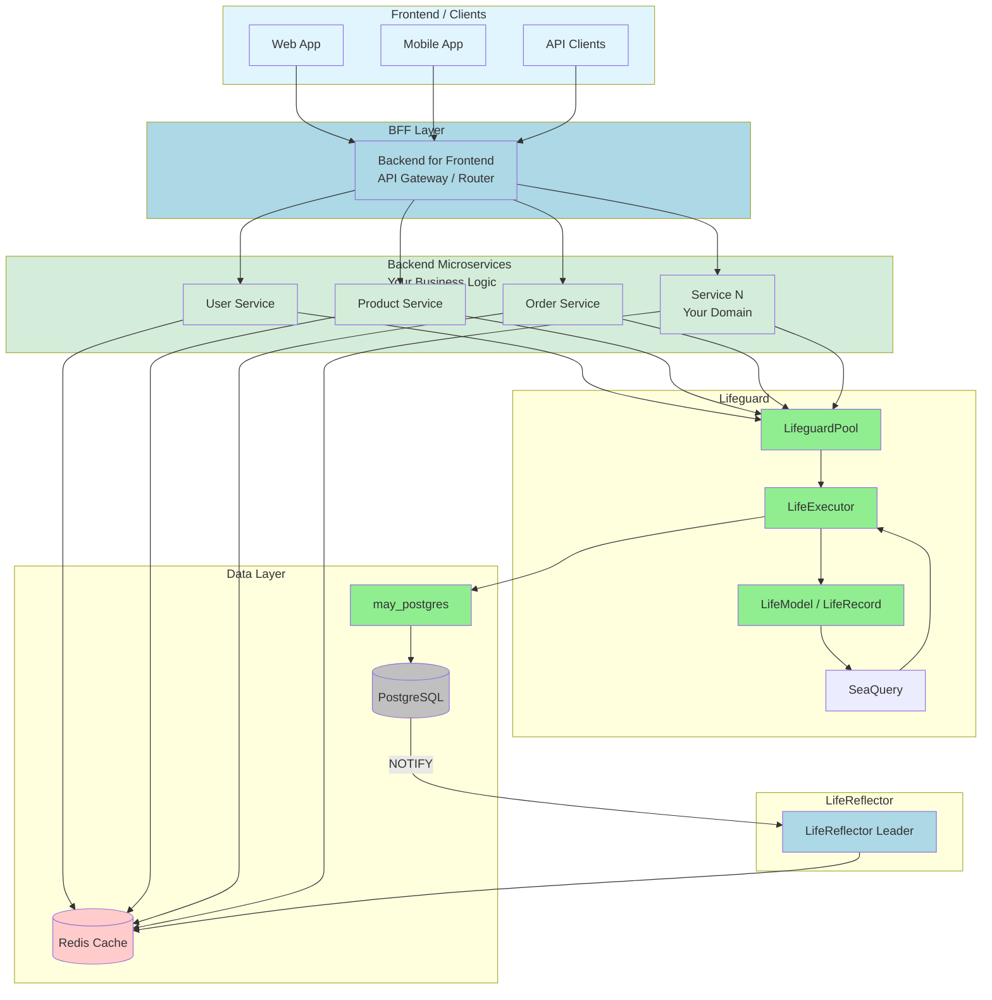
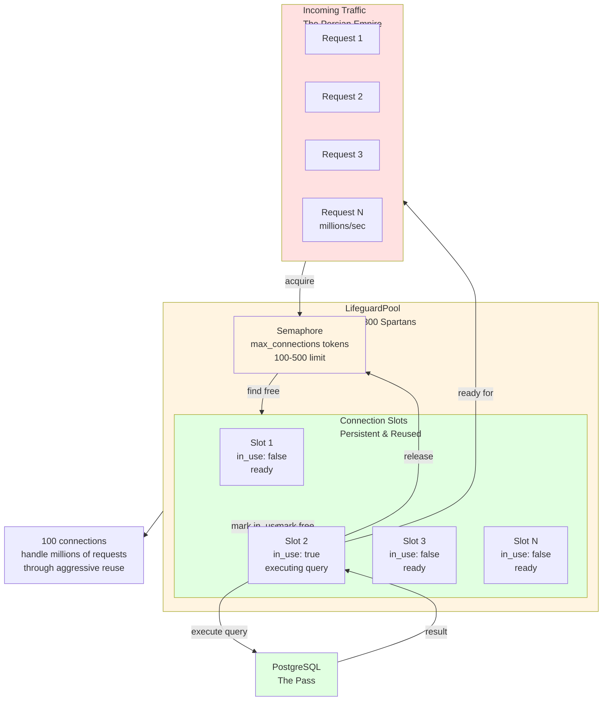
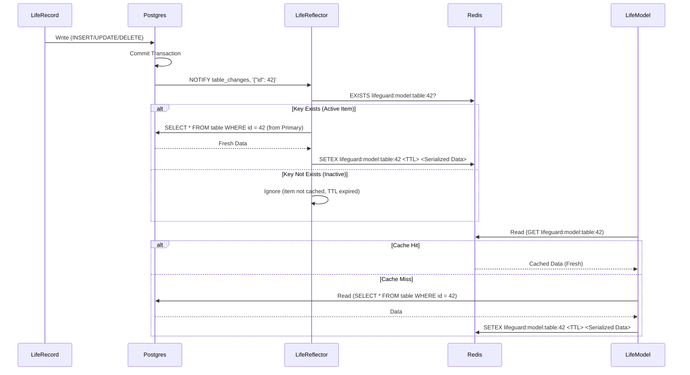

<p align="center">
  
</p>

# 🛟 Lifeguard: Coroutine-Driven Database Runtime for Rust

**Lifeguard** is a **coroutine-native PostgreSQL ORM and data access platform** built for Rust's `may` runtime. It aims for SeaORM-like ergonomics without async/`Tokio`: stackful coroutines and `may_postgres` as the database client.

### Current status (repository truth)

- **In this crate today:** `LifeExecutor` / `MayPostgresExecutor`, `connect` and connection helpers, `SelectQuery` and the query stack, `#[derive(LifeModel)]` / `#[derive(LifeRecord)]` (`lifeguard-derive`), relations (including loaders and `find_related` / linked paths), migrations (`lifeguard::migration`, `lifeguard-migrate`), transactions, raw SQL helpers, partial models, optional **metrics** (including pool `pool_tier` labels) and **tracing** features, **channel logging** (`lifeguard::logging`), and **`LifeguardPool`** / **`PooledLifeExecutor`** (`lifeguard::pool`, re-exported at the crate root).
- **Pool maturity:** the pool is **production-usable** for the supported design: one OS thread per slot, **bounded** per-worker queues, configurable **acquire timeout**, optional **replica** tier with **WAL lag** routing and monitor give-up, **slot heal** after connectivity-class errors, **idle liveness** probes, and **max connection lifetime** with jitter. Operators should tune from [POOLING_OPERATIONS.md](./docs/POOLING_OPERATIONS.md); the PRD tracks closure and future work in [PRD_CONNECTION_POOLING.md](./docs/planning/PRD_CONNECTION_POOLING.md).
- **LifeReflector (`lifeguard-reflector`):** distributed cache coherence is implemented in the workspace crate [`lifeguard-reflector`](./lifeguard-reflector/) (same repository as `lifeguard-derive`, `lifeguard-migrate`, and other `lifeguard-*` packages). Behavior and architecture are described below; the crate may be published or split out later without renaming it.
- **Docs vs code:** Mermaid diagrams and some marketing sections describe the **target** platform (cache tier, replica routing, pool). Treat [docs/planning/lifeguard-derive/SEAORM_LIFEGUARD_MAPPING.md](./docs/planning/lifeguard-derive/SEAORM_LIFEGUARD_MAPPING.md), `cargo doc`, and `examples/` as the ground truth for what compiles.

---

## 🔥 Why Lifeguard?

**The Problem:** Existing Rust ORMs (SeaORM, Diesel, SQLx) are built for async/await and Tokio. The `may` coroutine runtime uses stackful coroutines, not async futures. These are **fundamentally incompatible architectures**—you cannot bridge them without significant performance penalties.

**The Solution:** Build a complete ORM from scratch using `may_postgres` (coroutine-native PostgreSQL client). No async runtime. No Tokio. Pure coroutine I/O.

**Why This Matters:**
- **BRRTRouter** (the coroutine API framework) needs blistering fast database access for high-throughput applications
- High-performance microservices need predictable, low-latency database access without async overhead
- Applications with extreme scale requirements (millions of requests/second) need efficient connection pooling when database connections are limited
- Coroutines offer deterministic scheduling, lower memory overhead, and predictable latency
- But without a proper ORM, developers are forced to choose: async ORM (overhead) or raw SQL (no safety)

**Lifeguard solves this** by providing a complete data platform that matches SeaORM's feature set but is built for coroutines, plus **distributed cache coherence** (LifeReflector) that no other ORM provides.

---

## 🚀 What We're Building

### Core ORM: LifeModel & LifeRecord

A complete ORM system with two primary abstractions:

**LifeModel** (Immutable Database Rows)
- Represents database rows as immutable Rust structs
- Generated via `#[derive(LifeModel)]` procedural macro
- Provides type-safe query builders
- Automatic row-to-struct mapping
- Complete SeaORM API parity

**LifeRecord** (Mutable Change Sets)
- Separate abstraction for inserts and updates
- Generated via `#[derive(LifeRecord)]` procedural macro
- Type-safe mutation builders
- Automatic SQL generation via SeaQuery
- Change tracking (dirty fields)

```rust
use lifeguard_derive::{LifeModel, LifeRecord};

#[derive(LifeModel, LifeRecord)]
#[table_name = "users"]
struct User {
    #[primary_key]
    id: i64,
    email: String,
    is_active: bool,
}

// Inserts/selects go through LifeExecutor + SelectQuery / ActiveModelTrait;
// see lifeguard-derive tests and examples/ for full patterns (no Tokio required).
```

### Connection pool: LifeguardPool

**In-tree:** [`LifeguardPool`](./src/pool/pooled.rs) (re-exported as `lifeguard::LifeguardPool`) — persistent `may_postgres` connections, one worker per slot, bounded per-worker job queues, configurable acquire timeout ([`LifeError::PoolAcquireTimeout`](./src/executor.rs)), optional read-replica routing with [`WalLagMonitor`](./src/pool/wal.rs), slot heal, idle liveness, max connection lifetime, and Prometheus metrics with a low-cardinality **`pool_tier`** label (`primary` / `replica`) on pool-scoped series. See [POOLING_OPERATIONS.md](./docs/POOLING_OPERATIONS.md), [DESIGN_CONNECTION_POOLING.md](./docs/planning/DESIGN_CONNECTION_POOLING.md), and [OBSERVABILITY.md](./docs/OBSERVABILITY.md).

**Alternative:** open connections with [`connect`](./src/connection.rs) and run queries through [`MayPostgresExecutor`](./src/executor.rs) / [`LifeExecutor`](./src/executor.rs) when you do not need the pool. See [`examples/query_builder_example.rs`](./examples/query_builder_example.rs) for patterns.

### The Killer Feature: LifeReflector

**Distributed cache coherence system**—this is Lifeguard's unique advantage:

> **Note:** LifeReflector is developed as the **`lifeguard-reflector`** workspace crate in this repository ([`./lifeguard-reflector`](./lifeguard-reflector/)). Enterprise licensing may still apply for some distributions; see that crate’s README.

A **standalone microservice** that maintains cluster-wide cache coherence:

- **Leader-elected Raft system:** Only one active reflector at a time (no duplicate work)
- **Postgres LISTEN/NOTIFY integration:** Subscribes to database change events
- **Intelligent cache refresh:** Only **re-writes** keys that already exist in Redis (TTL-based **active set**—no stale copy to fix if the key was never cached)
- **Read path populates Redis:** Cache miss → load from Postgres → `SETEX` (with TTL); new rows enter Redis when something **reads** them (or via warm-up), not from `NOTIFY` alone
- **Horizontal scaling:** All microservices benefit from single reflector

**How it works:**

1. **Reads (population):** A service checks **Redis first**. On a **miss**, it reads from **Postgres** and **writes the row into Redis** (e.g. `SETEX` + TTL). First-time and cold rows are cached here—this is how Redis gets populated.
2. **LifeRecord** (or the writer) commits to **Postgres**; the database path emits **`NOTIFY`** (payload identifies the row).
3. **LifeReflector** (leader) receives the notification.
4. Reflector checks whether that entity **key already exists** in Redis (active cached item).
5. **If it exists** → Reflector **re-reads from Postgres** and **updates Redis** so no client keeps a pre-write value.
6. **If it does not exist** → Reflector **ignores** the notify: there is **no cached row to invalidate**—nothing in Redis was wrong. The next read miss still runs step (1) and loads fresh data from Postgres into Redis.
7. **Cross-service reads:** Once a key is in Redis, other services can read it from Redis; steps 2–6 keep **already-cached** keys aligned with Postgres after writes.

**Result:** Oracle Coherence–style **coherence for the active set** in Redis: lazy (or warmed) population on reads, plus **notify-driven refresh** only where a stale cache entry could otherwise exist. See the **sequence diagram** below (cache miss branch → Postgres → `SETEX`).

**Enterprise:** commercial or source-available licensing may apply for some LifeReflector deployments. Source and package layout live under [`lifeguard-reflector`](./lifeguard-reflector/); contact enterprise@microscaler.io for licensing questions.

### Transparent caching system (target)

**Target behavior** (not fully wired as “magic” on every read path in this crate today): Lifeguard’s design calls for caching that still respects PostgreSQL primaries and replicas:

- **Check Redis first:** Sub-millisecond reads if cached
- **Read from replicas:** When healthy (WAL lag < threshold)
- **Write to primary:** Always (as PostgreSQL was designed)
- **LifeReflector keeps cache fresh:** Automatic coherence across microservices ([`lifeguard-reflector`](./lifeguard-reflector/))

Your application code doesn't need to know about Redis, replicas, or cache coherence. It just calls `User::find_by_id(&pool, 42)?` and Lifeguard handles the rest.

**Note:** For distributed cache coherence across multiple microservices, [`lifeguard-reflector`](./lifeguard-reflector/) provides automatic cache refresh using PostgreSQL LISTEN/NOTIFY.

### Replica Read Support

Advanced read routing with WAL lag awareness:

- **WAL position tracking:** Monitors `pg_current_wal_lsn()` vs `pg_last_wal_replay_lsn()`
- **Dynamic health checks:** Automatically detects replica lag
- **Intelligent routing:** Routes reads to replicas only when healthy
- **Automatic fallback:** Falls back to primary if replicas are stale
- **Strong consistency mode:** Optional causal read-your-writes consistency

**Read Preference Modes:**
- `primary` - Always read from primary
- `replica` - Use replicas when healthy
- `mixed` - Automatic selection (Redis → replica → primary)
- `strong` - Causal consistency (wait for replica to catch up)

### Complete feature set (vision vs crate)

The lists below mix **shipped**, **partial**, and **planned** capabilities. For a maintained feature matrix, see [SEAORM_LIFEGUARD_MAPPING.md](./docs/planning/lifeguard-derive/SEAORM_LIFEGUARD_MAPPING.md).

**ORM features (SeaORM parity target):**
- ✅ Complete CRUD operations
- ✅ Type-safe query builders
- ✅ Relations (has_one, has_many, belongs_to, many_to_many)
- ✅ Migrations (programmatic, data seeding, advanced operations)
- ✅ Transactions
- ✅ Raw SQL helpers
- ✅ Batch operations
- ✅ Upsert support
- ✅ Pagination helpers
- ✅ Entity hooks & lifecycle events
- ✅ Validators
- ✅ Soft deletes
- ✅ Auto-managed timestamps

**Competitive Features:**
- ✅ Schema inference (Diesel `table!` macro equivalent)
- ✅ Session/Unit of Work pattern (SQLAlchemy)
- ✅ Scopes (ActiveRecord)
- ✅ Model Managers (Django)
- ✅ F() Expressions (Django)
- ✅ Advanced eager loading strategies (SQLAlchemy)

**Unique Features (No Other ORM Has):**
- ✅ **LifeReflector** - Distributed cache coherence
- ✅ **Coroutine-native** - No async overhead
- ✅ **WAL-based replica routing** - Automatic health monitoring
- ✅ **TTL-based active set** - Adaptive caching

---

## 🏗️ Architecture overview

Diagrams summarize the **target** platform (including pool and the [`lifeguard-reflector`](./lifeguard-reflector/) service). Components in grey or noted above may not be exposed from this crate yet.

### Target architecture


```mermaid
graph TD
    App[Application Code] --> Pool[LifeguardPool]
    Pool --> Executor[LifeExecutor]
    Executor --> may_postgres[may_postgres]
    may_postgres --> PostgreSQL[PostgreSQL]
    
    App --> LifeModel[LifeModel / LifeRecord]
    LifeModel --> SeaQuery[SeaQuery SQL Builder]
    SeaQuery --> Executor
    
    App --> Redis[Redis Cache]
    Redis --> LifeReflector[LifeReflector Service]
    PostgreSQL -- NOTIFY --> LifeReflector
    LifeReflector --> Redis
    
    style App fill:#add8e6,stroke:#333,stroke-width:2px
    style Pool fill:#90ee90,stroke:#333,stroke-width:2px
    style Executor fill:#90ee90,stroke:#333,stroke-width:2px
    style LifeModel fill:#90ee90,stroke:#333,stroke-width:2px
    style SeaQuery fill:#90ee90,stroke:#333,stroke-width:2px
    style may_postgres fill:#90ee90,stroke:#333,stroke-width:2px
    style PostgreSQL fill:#c0c0c0,stroke:#333,stroke-width:2px
    style Redis fill:#ffcccb,stroke:#333,stroke-width:2px
    style LifeReflector fill:#add8e6,stroke:#333,stroke-width:2px
```

**Key Components:**
- **LifeguardPool**: Persistent connection pool with semaphore-based acquisition
- **LifeExecutor**: Database execution abstraction over `may_postgres`
- **LifeModel/LifeRecord**: Complete ORM layer (replaces SeaORM)
- **SeaQuery**: SQL building (borrowed, compatible with coroutines)
- **may_postgres**: Coroutine-native PostgreSQL client (foundation)
- **LifeReflector**: Distributed cache coherence microservice
- **Redis**: Transparent caching layer


```mermaid
graph TD
    subgraph Frontend["Frontend / Clients"]
        Web[Web App]
        Mobile[Mobile App]
        API[API Clients]
    end
    
    subgraph BFF["BFF Layer<br/>Built with BRRTRouter"]
        BFF_Service[Backend for Frontend<br/>API Gateway / Router]
    end
    
    subgraph Backend["Backend Microservices<br/>Your Business Logic"]
        MS1[User Service]
        MS2[Product Service]
        MS3[Order Service]
        MSN[Service N<br/>Your Domain]
    end
    
    subgraph Lifeguard
        Pool[LifeguardPool]
        Executor[LifeExecutor]
        LifeModel[LifeModel / LifeRecord]
        SeaQuery[SeaQuery]
    end
    
    subgraph Data Layer
        may_postgres[may_postgres]
        PostgreSQL[(PostgreSQL)]
        Redis[(Redis Cache)]
    end
    
    subgraph LifeReflector
        Reflector[LifeReflector Leader]
    end
    
    Web --> BFF_Service
    Mobile --> BFF_Service
    API --> BFF_Service
    
    BFF_Service --> MS1
    BFF_Service --> MS2
    BFF_Service --> MS3
    BFF_Service --> MSN
    
    MS1 --> Pool
    MS2 --> Pool
    MS3 --> Pool
    MSN --> Pool
    
    Pool --> Executor
    Executor --> LifeModel
    LifeModel --> SeaQuery
    SeaQuery --> Executor
    Executor --> may_postgres
    may_postgres --> PostgreSQL
    
    MS1 --> Redis
    MS2 --> Redis
    MS3 --> Redis
    MSN --> Redis
    PostgreSQL -- NOTIFY --> Reflector
    Reflector --> Redis
    
    style Frontend fill:#e1f5ff
    style Web fill:#e1f5ff
    style Mobile fill:#e1f5ff
    style API fill:#e1f5ff
    style BFF fill:#add8e6
    style BFF_Service fill:#add8e6
    style Backend fill:#d4edda
    style MS1 fill:#d4edda
    style MS2 fill:#d4edda
    style MS3 fill:#d4edda
    style MSN fill:#d4edda
    style Pool fill:#90ee90
    style Executor fill:#90ee90
    style LifeModel fill:#90ee90
    style may_postgres fill:#90ee90
    style PostgreSQL fill:#c0c0c0
    style Redis fill:#ffcccb
    style Reflector fill:#add8e6
```

### Connection Pool Architecture


```mermaid
graph TD
    subgraph LifeguardPool["LifeguardPool<br/>The 300 Spartans"]
        S[Semaphore<br/>max_connections tokens<br/>100-500 limit]
        subgraph Slots["Connection Slots<br/>Persistent & Reused"]
            C1[Slot 1<br/>in_use: false<br/>ready]
            C2[Slot 2<br/>in_use: true<br/>executing query]
            C3[Slot 3<br/>in_use: false<br/>ready]
            CN[Slot N<br/>in_use: false<br/>ready]
        end
    end
    
    subgraph Traffic["Incoming Traffic<br/>The Persian Empire"]
        R1[Request 1]
        R2[Request 2]
        R3[Request 3]
        RN[Request N<br/>millions/sec]
    end
    
    Traffic -->|acquire| S
    S -->|find free| Slots
    Slots -->|mark in_use| C2
    C2 -->|execute query| PG[PostgreSQL<br/>The Pass]
    PG -->|result| C2
    C2 -->|release| S
    C2 -->|mark free| Slots
    C2 -->|ready for| Traffic
    
    style LifeguardPool fill:#fff4e1
    style S fill:#fff4e1
    style Slots fill:#e1ffe1
    style PG fill:#e1ffe1
    style Traffic fill:#ffe1e1
    
    Note[100 connections<br/>handle millions of requests<br/>through aggressive reuse]
    LifeguardPool --> Note
```

### LifeReflector Cache Coherence


```mermaid
sequenceDiagram
    participant LifeRecord
    participant Postgres
    participant LifeReflector
    participant Redis
    participant LifeModel

    LifeRecord->>Postgres: Write (INSERT/UPDATE/DELETE)
    Postgres->>Postgres: Commit Transaction
    Postgres->>LifeReflector: NOTIFY table_changes, '{"id": 42}'
    LifeReflector->>Redis: EXISTS lifeguard:model:table:42?
    alt Key Exists (Active Item)
        LifeReflector->>Postgres: SELECT * FROM table WHERE id = 42 (from Primary)
        Postgres-->>LifeReflector: Fresh Data
        LifeReflector->>Redis: SETEX lifeguard:model:table:42 <TTL> <Serialized Data>
    else Key Not Exists (Inactive)
        LifeReflector->>LifeReflector: Ignore (item not cached, TTL expired)
    end
    LifeModel->>Redis: Read (GET lifeguard:model:table:42)
    alt Cache Hit
        Redis-->>LifeModel: Cached Data (Fresh)
    else Cache Miss
        LifeModel->>Postgres: Read (SELECT * FROM table WHERE id = 42)
        Postgres-->>LifeModel: Data
        LifeModel->>Redis: SETEX lifeguard:model:table:42 <TTL> <Serialized Data>
    end
```


---

## 💻 Getting started

### Installation

```toml
[dependencies]
lifeguard = { git = "https://github.com/microscaler/lifeguard" }
lifeguard-derive = { git = "https://github.com/microscaler/lifeguard", package = "lifeguard-derive" }
```

Enable optional features as needed, for example `metrics`, `tracing`, or `graphql` (see root `Cargo.toml`).

### Usage (today)

1. **Direct client:** connect with `lifeguard::connect` and wrap the client in `MayPostgresExecutor`.
2. **Pooled:** build a [`LifeguardPool`](./src/pool/pooled.rs) (`new`, `new_with_settings`, or `from_database_config`) and use [`PooledLifeExecutor`](./src/pool/pooled.rs) for `LifeExecutor` traffic (see `cargo doc` on `lifeguard::pool`).
3. Define entities with `#[derive(LifeModel, LifeRecord)]` and `#[table_name = "..."]` (see [`lifeguard-derive/tests/test_minimal.rs`](./lifeguard-derive/tests/test_minimal.rs)).
4. Build queries with `SelectQuery` and related APIs; see [`examples/query_builder_example.rs`](./examples/query_builder_example.rs).

Pooling behavior and tunables evolve with [PRD_CONNECTION_POOLING.md](./docs/planning/PRD_CONNECTION_POOLING.md); prefer **rustdoc** for the exact public API at your revision.

### Developer workflow

- **[DEVELOPMENT.md](./DEVELOPMENT.md)** — Clippy (CI parity), pre-commit, `just` recipes.
- **[docs/TEST_INFRASTRUCTURE.md](./docs/TEST_INFRASTRUCTURE.md)** — Postgres/Redis for integration tests and CI.


---

## 📊 Observability

Comprehensive instrumentation for production operations:

### Prometheus Metrics

- `lifeguard_pool_size` - Current pool size
- `lifeguard_active_connections` - Active connections
- `lifeguard_connection_wait_time` - Time waiting for connection
- `lifeguard_query_duration_seconds` - Query execution time
- `lifeguard_query_errors_total` - Query errors
- `lifeguard_cache_hits_total` - Cache hits
- `lifeguard_cache_misses_total` - Cache misses
- `lifeguard_replica_lag_bytes` - Replica lag (bytes)
- `lifeguard_replica_lag_seconds` - Replica lag (seconds)
- `lifeguard_replicas_healthy` - Number of healthy replicas

### OpenTelemetry Tracing

- Distributed tracing for database operations
- Spans for: connection acquisition, query execution, cache operations
- Integration with existing OpenTelemetry infrastructure

**Host-owned globals:** Lifeguard does **not** set a global OpenTelemetry `TracerProvider`. Your service (for example **BRRTRouter**) must install **one** provider and **one** `tracing_subscriber::Registry` stack. Optionally add **`lifeguard::channel_layer()`** to that same `.with(...)` chain so events also go through Lifeguard’s may-channel logger. See **[docs/OBSERVABILITY_APP_INTEGRATION.md](docs/OBSERVABILITY_APP_INTEGRATION.md)** and the **`lifeguard::logging`** rustdoc.

### LifeReflector Metrics

- `reflector_notifications_total` - Notifications received
- `reflector_refreshes_total` - Cache refreshes
- `reflector_ignored_total` - Ignored notifications (inactive items)
- `reflector_active_keys` - Active cache keys
- `reflector_redis_latency_seconds` - Redis operation latency
- `reflector_pg_latency_seconds` - PostgreSQL operation latency
- `reflector_leader_changes_total` - Leader election events

---

## 🧪 Testing

- **Library tests:** `cargo test -p lifeguard`, workspace members (`lifeguard-derive`, `lifeguard-migrate`, etc.), and (when configured) `cargo nextest` per [DEVELOPMENT.md](./DEVELOPMENT.md) / [justfile](./justfile).
- **Integration database:** `lifeguard::test_helpers::TestDatabase` and env vars such as `TEST_DATABASE_URL` — see [docs/TEST_INFRASTRUCTURE.md](./docs/TEST_INFRASTRUCTURE.md).

There is **no** `lifeguard::testkit` / `test_pool!` macro in this repository; use `test_helpers` and the integration-test binaries under `tests/`.

---

## 🗺️ Roadmap

Epic-style checklists in older docs were overstated relative to this crate. Use these instead:

| Area | Status |
|------|--------|
| `may_postgres`, `LifeExecutor`, transactions, raw SQL | Shipped |
| `LifeModel` / `LifeRecord`, query builder, relations, loaders | Shipped (ongoing hardening) |
| Migrations (`lifeguard::migration`, `lifeguard-migrate`, example `generate-migrations`) | Shipped (tooling evolves) |
| Optional metrics / tracing / channel logging | Shipped behind features |
| `LifeguardPool` / `PooledLifeExecutor` (primary/replica, WAL, heal, metrics) | Shipped (see [POOLING_OPERATIONS.md](./docs/POOLING_OPERATIONS.md), PRD for remaining parity) |
| Replica **read-preference** API surface, transparent Redis on every query | Planned / partial |
| LifeReflector, enterprise cache coherence | In-tree [`lifeguard-reflector`](./lifeguard-reflector/) (evolving) |

Story-level detail: [docs/planning/epics-stories/](./docs/planning/epics-stories/) · Feature audit: [docs/planning/lifeguard-derive/SEAORM_LIFEGUARD_MAPPING.md](./docs/planning/lifeguard-derive/SEAORM_LIFEGUARD_MAPPING.md) · [docs/EPICS/](./docs/EPICS/) (curated notes).

---

## 🎯 Competitive metrics: Lifeguard vs Rust ORMs

*Snapshot for quick orientation. **Implementation Status** labels **shipped** crate behavior (including optional features), **partial** gaps, and **vision** rows (especially transparent cache and explicit read-preference APIs). Authoritative row-by-row coverage and percentages live in [SEAORM_LIFEGUARD_MAPPING.md](./docs/planning/lifeguard-derive/SEAORM_LIFEGUARD_MAPPING.md) and `cargo doc`. The [short summary](#implementation-status-summary-short) below tracks README “current status” completion.*

| Feature | Lifeguard Promise | Implementation Status | SeaORM | Diesel | SQLx |
|---------|-------------------|----------------------|--------|--------|------|
| **Concurrency Model** | ✅ Coroutine-native (`may`) | ✅ **Implemented** | ❌ Async/await (Tokio) | ❌ Sync-only | ❌ Async/await (Tokio) |
| **Performance (Hot Paths)** | ✅✅✅ 2-5× faster | 🟡 **Architectural** | ⚠️ Async overhead | ✅ Fast (sync) | ⚠️ Async overhead |
| **Performance (Small Queries)** | ✅✅✅ 10×+ faster | 🟡 **Architectural** | ⚠️ Future allocation | ✅ Fast | ⚠️ Future allocation |
| **Memory Footprint** | ✅✅ Low (stackful coroutines) | 🟡 **Architectural** | ⚠️ Higher (heap futures) | ✅ Low | ⚠️ Higher (heap futures) |
| **Predictable Latency** | ✅✅✅ Deterministic scheduling | 🟡 **Architectural** | ⚠️ Poll-based (variable) | ✅ Predictable | ⚠️ Poll-based (variable) |
| **Type Safety** | ✅✅✅ Compile-time validation | ✅ **Implemented** | ✅✅ Compile-time validation | ✅✅✅ Strong compile-time | ✅✅ Compile-time SQL checks |
| **ORM Features** | ✅✅✅ Complete (SeaORM parity) | 🟡 **High coverage** (core traits, relations, query builder; see mapping doc for %) | ✅✅✅ Complete | ✅✅ Good | ❌ Query builder only |
| **CRUD Operations** | ✅✅✅ Full support | ✅ **Implemented** (insert/update/save/delete via ActiveModelTrait) | ✅✅✅ Full support | ✅✅ Full support | ⚠️ Manual SQL |
| **Relations** | ✅✅✅ All types (has_one, has_many, belongs_to, many_to_many) | ✅ **Implemented** (Complete with eager/lazy loading, composite keys, DeriveLinked) | ✅✅✅ All types | ✅✅ Basic support | ❌ Manual joins |
| **Migrations** | ✅✅✅ Programmatic, data seeding, advanced ops | 🟡 **Partial** (`lifeguard::migration` + `lifeguard-migrate` shipped; `DeriveMigrationName` etc. still future per mapping) | ✅✅✅ Programmatic | ✅✅ CLI-based | ⚠️ Manual SQL |
| **Schema Inference** | ✅✅✅ From database (Diesel equivalent) | ❌ **Not Implemented** | ✅✅ From database | ✅✅✅ `table!` macro | ❌ No |
| **Query Builder** | ✅✅✅ Type-safe, chainable | ✅ **Implemented** (19/20 methods, 95% coverage) | ✅✅✅ Type-safe, chainable | ✅✅✅ Compile-time checked | ✅✅ Compile-time SQL |
| **Transactions** | ✅✅✅ Full support | ✅ **Implemented** (Roadmap Epic 01) | ✅✅✅ Full support | ✅✅ Full support | ✅✅ Full support |
| **Batch Operations** | ✅✅✅ insert_many, update_many, delete_many | ✅ **Implemented** | ✅✅✅ Batch support | ✅✅ Batch support | ⚠️ Manual |
| **Upsert** | ✅✅✅ save(), on_conflict() | ✅ **Implemented** (save() method exists) | ✅✅✅ save(), on_conflict() | ✅✅ on_conflict() | ⚠️ Manual SQL |
| **Pagination** | ✅✅✅ paginate(), paginate_and_count() | ✅ **Implemented** | ✅✅✅ Pagination helpers | ⚠️ Manual | ⚠️ Manual |
| **Entity Hooks** | ✅✅✅ before/after lifecycle events | ✅ **Implemented** (ActiveModelBehavior with 8 lifecycle hooks) | ✅✅✅ Hooks support | ❌ No | ❌ No |
| **Validators** | ✅✅✅ Field & model-level | ❌ **Not Implemented** | ⚠️ Limited | ❌ No | ❌ No |
| **Soft Deletes** | ✅✅✅ Built-in support | ✅ **Implemented** (`#[soft_delete]` + `SelectQuery` / loader filtering) | ⚠️ Manual | ❌ No | ❌ No |
| **Auto Timestamps** | ✅✅✅ created_at, updated_at | ✅ **Implemented** (`#[auto_timestamp]` on `LifeRecord` insert/update paths) | ⚠️ Manual | ❌ No | ❌ No |
| **Session/Unit of Work** | ✅✅✅ Identity map, dirty tracking | ❌ **Not Implemented** | ❌ No | ❌ No | ❌ No |
| **Scopes** | ✅✅✅ Named query scopes | ❌ **Not Implemented** | ❌ No | ❌ No | ❌ No |
| **Model Managers** | ✅✅✅ Custom query methods | ✅ **Implemented** (ModelManager trait + custom methods pattern) | ❌ No | ❌ No | ❌ No |
| **F() Expressions** | ✅✅✅ Database-level expressions | ❌ **Not Implemented** | ❌ No | ⚠️ Limited | ❌ No |
| **Subqueries** | ✅✅✅ Full support | 🟡 **Future** (Not yet implemented) | ✅✅✅ Full support | ✅✅ Full support | ✅✅ Manual SQL |
| **CTEs** | ✅✅✅ WITH clauses | 🟡 **Future** (Not yet implemented) | ✅✅✅ WITH clauses | ✅✅ WITH clauses | ✅✅ Manual SQL |
| **Window Functions** | ✅✅✅ Full support | 🟡 **Future** (Not yet implemented) | ✅✅✅ Full support | ✅✅ Full support | ✅✅ Manual SQL |
| **Eager Loading** | ✅✅✅ Multiple strategies (joinedload, subqueryload, selectinload) | ✅ **Implemented** (selectinload strategy with FK extraction) | ✅✅✅ Eager loading | ⚠️ Manual | ❌ Manual |
| **Raw SQL** | ✅✅✅ find_by_statement(), execute_unprepared() | ✅ **Implemented** (Architecture supports raw SQL) | ✅✅✅ Raw SQL support | ✅✅✅ Raw SQL support | ✅✅✅ Primary feature |
| **Connection Pooling** | ✅✅✅ Persistent, semaphore-based, health monitoring | ✅ **Shipped** ([`LifeguardPool`](./src/pool/pooled.rs): bounded queues, acquire timeout, heal, lifetime, metrics w/ `pool_tier`; see [pooling PRD](./docs/planning/PRD_CONNECTION_POOLING.md) for remaining parity) | ✅✅✅ Built-in pool | ⚠️ External (r2d2) | ✅✅✅ Built-in pool |
| **Replica Read Support** | ✅✅✅ WAL-based health monitoring, automatic routing | ✅ **Shipped** (replica tier + [`WalLagMonitor`](./src/pool/wal.rs); routing is pool-internal, not SeaORM-identical API) | ❌ No | ❌ No | ❌ No |
| **Read Preferences** | ✅✅✅ primary, replica, mixed, strong | 🟡 **Partial** (transparent routing via pool/WAL; no SeaORM-style explicit read-preference enum API) | ❌ No | ❌ No | ❌ No |
| **Distributed Caching** | ✅✅✅✅ **LifeReflector (UNIQUE)** | 🟡 **Architectural** (Not in SeaORM mapping, may exist) | ❌ No | ❌ No | ❌ No |
| **Cache Coherence** | ✅✅✅✅ **Zero-stale reads (UNIQUE)** | 🟡 **Architectural** (Not in SeaORM mapping, may exist) | ❌ No | ❌ No | ❌ No |
| **TTL-Based Active Set** | ✅✅✅✅ **Adaptive caching (UNIQUE)** | 🟡 **Architectural** (Not in SeaORM mapping, may exist) | ❌ No | ❌ No | ❌ No |
| **PostgreSQL Features** | ✅✅✅ Views, materialized views, JSONB, FTS, PostGIS, partitioning | 🟡 **Partial** (JSONB ✅ core feature, others future) | ✅✅✅ Most features | ✅✅✅ Most features | ✅✅✅ All features (raw SQL) |
| **Observability** | ✅✅✅ Prometheus, OpenTelemetry, comprehensive metrics | ✅ **Implemented** (optional `metrics` / `tracing`; Prometheus scrape; pool series with `pool_tier`) | ✅✅ Basic metrics | ⚠️ Limited | ⚠️ Limited |
| **Developer Experience** | ✅✅✅ Familiar API, no async/await, clear errors | ✅ **Implemented** (SeaORM-like API) | ✅✅✅ Good, async/await required | ⚠️ Complex type system | ✅✅ Good, async/await required |
| **Learning Curve** | ✅✅ Moderate (familiar if you know SeaORM) | ✅ **Implemented** (SeaORM-like API) | ✅✅ Moderate | ⚠️ Steep (complex macros) | ✅✅ Moderate |
| **Production Ready** | ✅✅✅ Complete observability, health checks, metrics | 🟡 **Workload-dependent** (core ORM + pool + metrics/tracing ship; validate migrations, cache, and ops for your deployment) | ✅✅✅ Production ready | ✅✅✅ Production ready | ✅✅✅ Production ready |
| **Multi-Database** | ❌ PostgreSQL only (by design) | ✅ **By Design** | ✅✅ PostgreSQL, MySQL, SQLite | ✅✅ PostgreSQL, MySQL, SQLite | ✅✅✅ PostgreSQL, MySQL, SQLite, MSSQL |
| **Coroutine Runtime** | ✅✅✅✅ **Native support (UNIQUE)** | ✅ **Implemented** | ❌ Incompatible | ❌ Incompatible | ❌ Incompatible |

### Legend

**Implementation Status Column:**
- ✅ **Implemented** = Feature is fully implemented and working
- 🟡 **Partial/Future/Architectural** = Partially implemented, planned for future, or architectural feature (not in SeaORM mapping)
- ❌ **Not Implemented** = Feature promised but not yet implemented

**Feature Comparison Columns:**
- ✅✅✅✅ = **Unique advantage** (no other ORM has this)
- ✅✅✅ = Excellent support
- ✅✅ = Good support
- ✅ = Basic support
- ⚠️ = Limited or manual implementation required
- ❌ = Not supported

### Implementation status summary (short)

**Strong in-tree today:** core traits (`LifeModelTrait`, `ModelTrait`, `ActiveModelTrait`, …), CRUD/save paths, `SelectQuery` stack, relations and eager/loader paths (including composite keys and linked traversals), migrations framework (`lifeguard::migration`, `lifeguard-migrate`), JSON column support, derive **`#[soft_delete]`** / **`#[auto_timestamp]`**, partial models, lifecycle hooks, **`LifeguardPool`** / **`PooledLifeExecutor`** with primary+replica tiers, WAL lag routing, slot heal, idle liveness, max connection lifetime, and optional **metrics** (including **`pool_tier`** labels) / **tracing**.

**Partial or roadmap:** higher-level validators, scopes, session/UoW, some SQL builder extras (subqueries/CTEs/windows), schema inference from DB, explicit read-preference API surface (pool routing is already shipped), migration derive niceties (e.g. `DeriveMigrationName` per mapping), and any remaining pooling parity called out in [PRD_CONNECTION_POOLING.md](./docs/planning/PRD_CONNECTION_POOLING.md) and [POOLING_OPERATIONS.md](./docs/POOLING_OPERATIONS.md).

**Roadmap / vision:** productized “transparent Redis on every read”; LifeReflector and cache coherence in [`lifeguard-reflector`](./lifeguard-reflector/).

For percentages and row-by-row status, use the mapping document linked in the section intro rather than this README table alone.

### Key Differentiators

**Lifeguard's Unique Advantages:**
1. **LifeReflector** - Distributed cache coherence (Oracle Coherence–style active set) — **unique**; **🟡** product evolution in [`lifeguard-reflector`](./lifeguard-reflector/)
2. **Coroutine-Native** - No async overhead, deterministic scheduling — **unique** among these ORMs ✅
3. **WAL-Based Replica Routing** - Pool + [`WalLagMonitor`](./src/pool/wal.rs) — **shipped** for `LifeguardPool` reads ✅
4. **TTL-Based Active Set** - Adaptive caching — **🟡** vision / reflector path; not automatic on every app read
5. **DeriveLinked Macro** - Multi-hop relationship code generation — **competitive advantage** ✅ (SeaORM has no direct equivalent)
6. **Session/Unit of Work** - Identity map, automatic change tracking — **not in Lifeguard yet** ❌

**Where Lifeguard Matches or Exceeds:**
- ✅ Substantial SeaORM-oriented coverage (see mapping doc for %; core ORM paths strong)
- ✅ Relations system with composite keys and eager/lazy loading
- ✅ Query builder with 95% method coverage
- ✅ Better performance potential (2-5× faster on hot paths - architectural)
- ✅ Lower memory footprint (architectural)
- ✅ Predictable latency (architectural)

**Trade-offs:**
- ❌ PostgreSQL-only (by design - enables advanced features)
- ❌ Requires `may` coroutine runtime (not Tokio)
- ❌ Smaller ecosystem (newer project)
- ⚠️ Some roadmap items remain (validators, scopes, session/UoW, explicit read-preference API, SQL builder extras, migration derives, etc.); see mapping doc and pooling docs

### Performance Comparison (Estimated)

| Metric | Lifeguard | SeaORM | Diesel | SQLx |
|--------|-----------|--------|--------|------|
| **Simple Query Latency** | 0.1-0.5ms | 0.5-2ms | 0.2-1ms | 0.5-2ms |
| **Hot Path Throughput** | 2-5× faster | Baseline | 1-2× faster | Baseline |
| **Small Query Overhead** | Minimal | Future allocation | Minimal | Future allocation |
| **Memory per Connection** | ~100 bytes | ~1-2 KB | ~100 bytes | ~1-2 KB |
| **Concurrent Connections** | 800+ (1MB stack) | Limited by Tokio | Limited by threads | Limited by Tokio |
| **p99 Latency** | < 5ms (predictable) | 5-20ms (variable) | < 5ms (predictable) | 5-20ms (variable) |

*Note: Performance numbers are estimates based on architecture. Actual benchmarks will be published after implementation.*

### Ecosystem Compatibility

**⚠️ Important: BRRTRouter and Lifeguard are a parallel ecosystem, separate from async/await Rust.**

These are **two incompatible worlds** with the only commonality being Rust itself:

| Ecosystem | Runtime | ORM Options | Incompatible With |
|-----------|---------|-------------|-------------------|
| **BRRTRouter + Lifeguard** | `may` coroutines | Lifeguard only | SeaORM, Diesel (async), SQLx, Tokio |
| **Tokio + Async ORMs** | `async/await` | SeaORM, Diesel, SQLx | BRRTRouter, Lifeguard, `may` |

**You cannot mix and match.** If you're using BRRTRouter, you **must** use Lifeguard. The async/await ORMs (SeaORM, Diesel, SQLx) are fundamentally incompatible with the `may` coroutine runtime.

### When to Use Each Ecosystem

**Use BRRTRouter + Lifeguard if:**
- ✅ You're building with **BRRTRouter** (the coroutine API framework)
- ✅ You need **distributed cache coherence** (LifeReflector - unique to Lifeguard)
- ✅ You need **extreme scale** (millions of requests/second)
- ✅ You need **predictable latency** (API routers, real-time systems)
- ✅ You're **PostgreSQL-only** (enables advanced features)
- ✅ You want **Oracle Coherence-level functionality**

**Use Tokio + Async ORMs if:**
- ✅ You're using **Tokio/async-await** runtime
- ✅ You need **multi-database support** (PostgreSQL, MySQL, SQLite, MSSQL)
- ✅ You want **mature, well-documented ORMs** (SeaORM, Diesel, SQLx)
- ✅ You don't need distributed cache coherence
- ✅ You're building traditional async/await microservices

**The choice is made at the ecosystem level, not the ORM level.** Once you choose BRRTRouter, Lifeguard is your only ORM option. Once you choose Tokio, you can choose between SeaORM, Diesel, or SQLx—but you cannot use BRRTRouter.

---

## 🚀 Performance

**Target Performance:**
- 2-5× faster than async ORMs on hot paths
- 10×+ faster on small queries (no future allocation overhead)
- Predictable p99 latency (< 5ms for simple queries)
- Lower memory footprint than async alternatives

**Real-World Use Cases:**
- **BRRTRouter**: High-throughput API routing with sub-millisecond database access (100,000+ requests/second)
- **High-Scale Microservices**: Applications requiring millions of requests/second with limited database connections
- **Low-Latency Systems**: Real-time applications needing predictable p99 latency (< 5ms) for database operations

---

## 📚 Documentation

- [Developer workflow & Clippy / pre-commit](./DEVELOPMENT.md)
- [Tests & CI Postgres/Redis](./docs/TEST_INFRASTRUCTURE.md)
- [Observability & host-owned OTel/tracing](./docs/OBSERVABILITY_APP_INTEGRATION.md)
- [Metrics, tracing, **Kind/Tilt `kubectl apply`** to refresh Grafana dashboards, and Postgres replication lag (time vs bytes)](./docs/OBSERVABILITY.md#kubernetes-kind-tilt-apply-and-refresh-dashboards)
- [**Connection pool** operations, tuning, non-goals (PgBouncer), migration notes](./docs/POOLING_OPERATIONS.md) · [design doc (queue policy, metrics, decisions)](./docs/planning/DESIGN_CONNECTION_POOLING.md)
- [SeaORM ↔ Lifeguard mapping](./docs/planning/lifeguard-derive/SEAORM_LIFEGUARD_MAPPING.md)
- [Epic notes](./docs/EPICS/) · [Story tree](./docs/planning/epics-stories/)
- [Planning index](./docs/planning/README.md)

---

## 🤝 Contributing

Lifeguard is under active development. We welcome:
- 📝 Documentation improvements
- 🐛 Bug reports
- 💡 Feature suggestions
- 🧪 Testing and feedback

See [EPICS](./docs/EPICS/) for current development priorities.


---

## 📜 License

Licensed under **MIT OR Apache-2.0** at your option ([`Cargo.toml`](./Cargo.toml)). The [`LICENSE`](./LICENSE) file in this repository contains the Apache-2.0 text.
