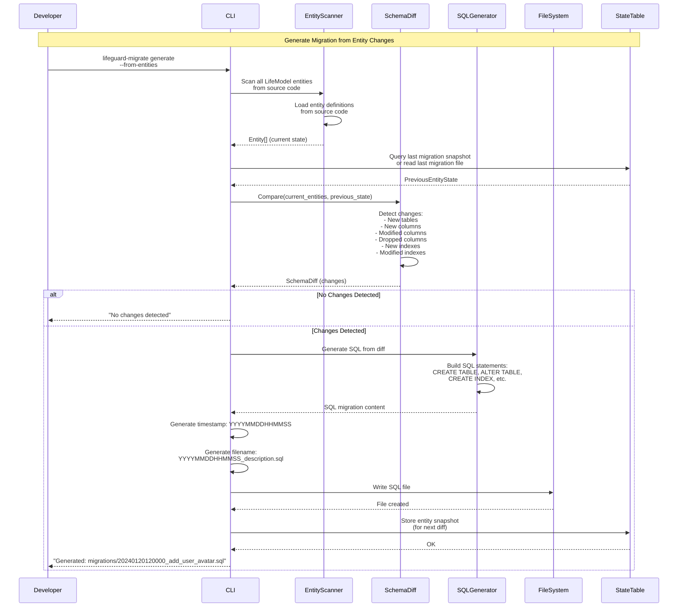
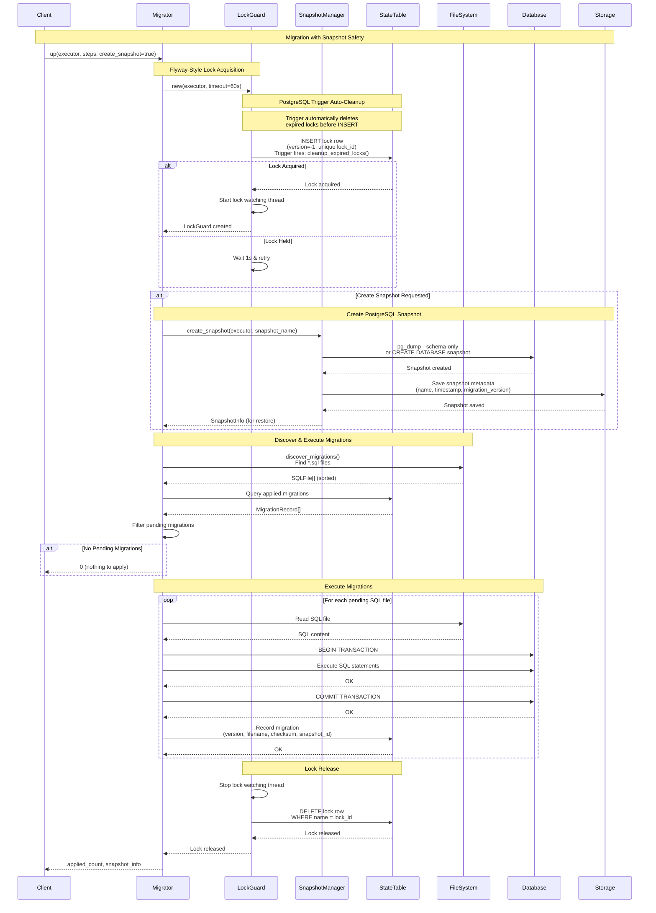
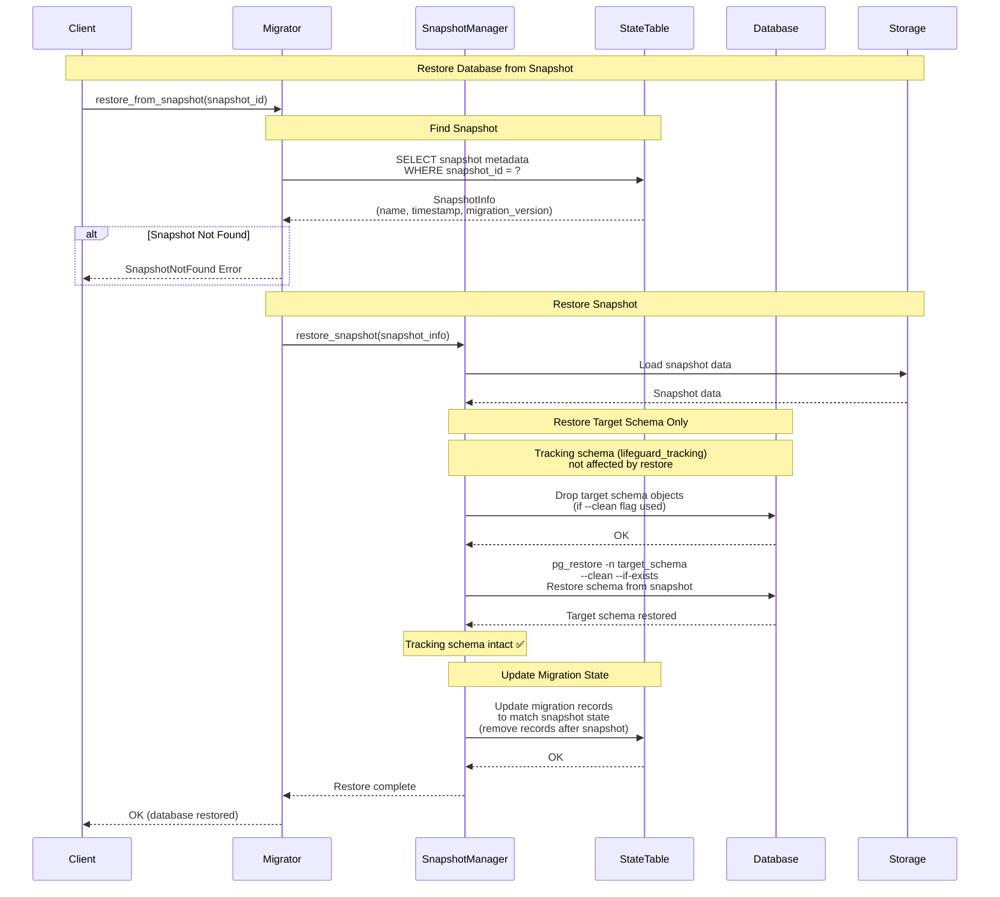
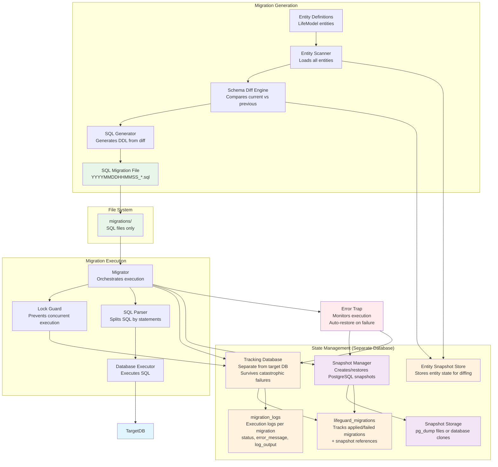
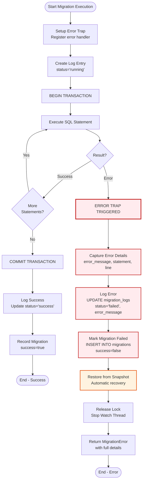

# Lifeguard Migration System - Redesigned Process Diagrams

## Design Philosophy: SQL-Only Migrations with Entity-Driven Generation

**Key Principles:**
1. **SQL is the source of truth** - Only SQL files, no Rust wrapper files
2. **Entity-driven generation** - Generate migrations by diffing current entities vs previous state
3. **Simple execution** - Just execute SQL files in order (like Flyway)
4. **State tracking** - Track which SQL files have been executed
5. **Separate tracking database** - Migration state stored outside target database (survives catastrophic failures)
6. **Error trap mechanism** - Automatic snapshot restore and cleanup on migration failure

**Benefits:**
- ✅ No redundant Rust files wrapping SQL
- ✅ Migrations are readable SQL (can be run with `psql` directly)
- ✅ Entity changes automatically generate migration SQL
- ✅ Simpler, proven approach (Django, Rails, Flyway pattern)
- ✅ Better SRE experience - SQL files are self-documenting
- ✅ Crash-safe - Separate tracking database survives target DB failures
- ✅ Automatic recovery - Trap mechanism restores snapshot on error

---

## Sequence Diagram: Entity-Driven Migration Generation



## Sequence Diagram: SQL-Only Migration Execution (Up) with Optional Snapshot

```mermaid
sequenceDiagram
    participant Client
    participant Migrator
    participant LockGuard
    participant FileSystem
    participant SQLParser
    participant TargetDB[Target Database<br/>Being Migrated]
    participant TrackingDB[Tracking Database<br/>Migration State]
    participant SnapshotMgr[Snapshot Manager]

    Note over Client,SnapshotMgr: Execute SQL Migrations with Error Trap

    Client->>Migrator: up(executor, steps, create_snapshot=true)
    
    Note over Migrator,LockGuard: Flyway-Style Lock Acquisition
    Note over Migrator,TrackingDB: Use Tracking DB for State (Separate from Target DB)
    Migrator->>TrackingDB: Connect to tracking database<br/>(separate schema or database)
    Migrator->>TrackingDB: initialize_state_table()<br/>CREATE TABLE IF NOT EXISTS<br/>+ CREATE TRIGGER for auto-cleanup
    TrackingDB-->>Migrator: State table + trigger ready
    
    Migrator->>LockGuard: new(tracking_db_executor, timeout=60s)
    Note over LockGuard,TrackingDB: PostgreSQL Auto-Cleanup
    Note over LockGuard,TrackingDB: Trigger automatically deletes<br/>expired locks on INSERT attempt<br/>(no manual cleanup needed)
    
    Note over LockGuard,TrackingDB: Try to Acquire Lock
    LockGuard->>LockGuard: Generate unique lock_id<br/>(random 128-bit hex string)
    LockGuard->>TrackingDB: INSERT lock row<br/>(version=-1, name=lock_id,<br/>type='flyway-lock')
    Note over TrackingDB: Trigger fires automatically:<br/>cleanup_expired_locks()<br/>deletes locks older than 10min
    alt Lock Acquired (INSERT succeeded)
        TrackingDB-->>LockGuard: rows_affected > 0<br/>Lock acquired!
        LockGuard->>LockGuard: Start lock watching thread<br/>(updates lock every 5 minutes)
        LockGuard-->>Migrator: LockGuard created
    else Lock Held (INSERT failed - PK constraint)
        TrackingDB-->>LockGuard: rows_affected = 0<br/>or constraint violation
        LockGuard->>LockGuard: Wait 1 second
        Note over LockGuard: Retry loop (up to timeout)
        Note over LockGuard: Trigger auto-cleans<br/>on each retry attempt
        LockGuard->>TrackingDB: Retry lock acquisition<br/>(trigger fires again)
    end

    alt Create Snapshot Requested
        Note over Migrator,SnapshotMgr: Create Schema-Level Snapshot
        Note over Migrator,SnapshotMgr: Snapshot only target schema<br/>Tracking schema remains untouched
        Migrator->>SnapshotMgr: create_snapshot(target_schema, target_db)
        SnapshotMgr->>TargetDB: pg_dump -n target_schema<br/>--schema-only --data<br/>-F c (custom format)
        TargetDB-->>SnapshotMgr: Snapshot created (schema-level)
        SnapshotMgr-->>Migrator: snapshot_id, snapshot_path
        Migrator->>TrackingDB: Store snapshot metadata<br/>(snapshot_id, schema_name, timestamp, version)
        TrackingDB-->>Migrator: Snapshot recorded
        Note over SnapshotMgr: Tracking schema (lifeguard_tracking)<br/>not included in snapshot ✅
    end

    Note over Migrator,FileSystem: Discover SQL Files
    Migrator->>FileSystem: discover_migrations()<br/>Find *.sql files<br/>Pattern: YYYYMMDDHHMMSS_*.sql
    FileSystem-->>Migrator: SQLFile[] (sorted by version)
    
    Migrator->>TrackingDB: SELECT applied migrations<br/>WHERE version > 0<br/>AND success = true
    TrackingDB-->>Migrator: MigrationRecord[]
    
    Note over Migrator: Compare & Validate
    Migrator->>Migrator: Filter pending migrations<br/>(exclude failed migrations)
    Migrator->>Migrator: Validate checksums<br/>(applied vs files)
    alt Checksum Mismatch
        Migrator-->>Client: ChecksumMismatch Error
    end
    
    alt No Pending Migrations
        Migrator-->>Client: 0 (nothing to apply)
    end

    Note over Migrator,TargetDB: Execute SQL Files with Error Trap
    loop For each pending SQL file
        Migrator->>Migrator: start = Instant::now()
        Migrator->>FileSystem: Read SQL file content
        FileSystem-->>Migrator: SQL content (string)
        
        Migrator->>SQLParser: Parse SQL file<br/>(split by semicolons,<br/>handle comments, etc.)
        SQLParser-->>Migrator: SQLStatement[]
        
        Note over Migrator,TrackingDB: Setup Error Trap
        Migrator->>TrackingDB: INSERT migration_log entry<br/>(version, status='running',<br/>started_at=NOW())
        TrackingDB-->>Migrator: Log entry created
        
        Migrator->>TargetDB: BEGIN TRANSACTION
        TargetDB-->>Migrator: OK
        
        alt Error Trap: Monitor SQL Execution
            loop For each SQL statement
                Migrator->>TargetDB: Execute SQL statement
                alt SQL Execution Success
                    TargetDB-->>Migrator: OK
                    Migrator->>TrackingDB: Append log entry<br/>UPDATE migration_log<br/>SET log_output = log_output || 'Statement executed'
                else SQL Execution Error
                    TargetDB-->>Migrator: Error (PostgreSQL rejection)
                    Note over Migrator,SnapshotMgr: ERROR TRAP TRIGGERED
                    Migrator->>Migrator: Capture error details<br/>(error message, statement, line number)
                    Migrator->>TrackingDB: UPDATE migration_log<br/>SET status='failed',<br/>error_message=?, log_output=?
                    TrackingDB-->>Migrator: Failure logged
                    Migrator->>TrackingDB: INSERT migration record<br/>(version, success=false,<br/>error_message=?)
                    TrackingDB-->>Migrator: Failed migration recorded
                    
                    Note over Migrator,SnapshotMgr: Automatic Cleanup
                    Note over Migrator,SnapshotMgr: Restore only target schema<br/>Tracking schema remains untouched
                    Migrator->>SnapshotMgr: restore_from_snapshot(snapshot_id)
                    SnapshotMgr->>TargetDB: pg_restore -n target_schema<br/>--clean --if-exists<br/>Restore schema from snapshot
                    TargetDB-->>SnapshotMgr: Target schema restored
                    Note over SnapshotMgr: Tracking schema (lifeguard_tracking)<br/>not affected by restore ✅
                    SnapshotMgr-->>Migrator: Restore complete
                    
                    Migrator->>LockGuard: Release lock
                    LockGuard->>TrackingDB: DELETE lock row<br/>WHERE name = lock_id
                    TrackingDB-->>LockGuard: Lock released
                    
                    Migrator-->>Client: MigrationError<br/>(with error details)
                end
            end
        end
        
        alt All Statements Succeeded
            Migrator->>TargetDB: COMMIT TRANSACTION
            TargetDB-->>Migrator: OK
            
            Note over Migrator,TrackingDB: Record Successful Migration
            Migrator->>Migrator: execution_time = elapsed()
            Migrator->>Migrator: Calculate checksum (SHA-256)
            Migrator->>TrackingDB: UPDATE migration_log<br/>SET status='success', execution_time=?
            Migrator->>TrackingDB: INSERT migration record<br/>(version, filename, checksum,<br/>snapshot_id, success=true)
            TrackingDB-->>Migrator: Migration recorded
        end
    end

    Note over LockGuard,TrackingDB: Lock Release
    LockGuard->>LockGuard: Stop lock watching thread
    LockGuard->>TrackingDB: DELETE lock row<br/>WHERE version = -1<br/>AND name = lock_id
    TrackingDB-->>LockGuard: Lock released
    LockGuard-->>Migrator: Lock released (Drop)
    
    Migrator-->>Client: applied_count
```

## Sequence Diagram: Migration with PostgreSQL Snapshot



## Sequence Diagram: Restore from Snapshot



## Flowchart: Complete Migration System Flow

```mermaid
flowchart TD
    Start([Start]) --> Operation{Operation?}
    
    Operation -->|Generate| GenerateFlow[Generate Migration]
    Operation -->|Up| UpFlow[Execute Migrations<br/>with Snapshot]
    Operation -->|Restore| RestoreFlow[Restore from Snapshot]
    Operation -->|Status| StatusFlow[Check Status]
    
    %% Generate Flow
    GenerateFlow --> ScanEntities[Scan LifeModel Entities<br/>from source code]
    ScanEntities --> LoadPrevious[Load Previous Entity State<br/>from last migration or snapshot]
    LoadPrevious --> CompareDiff[Compare Current vs Previous<br/>Detect: new tables, columns, indexes, etc.]
    CompareDiff --> HasChanges{Changes<br/>Detected?}
    HasChanges -->|No| NoChanges[Return: No changes]
    HasChanges -->|Yes| GenerateSQL[Generate SQL from Diff<br/>CREATE TABLE, ALTER TABLE, etc.]
    GenerateSQL --> CreateFile[Create SQL File<br/>YYYYMMDDHHMMSS_description.sql]
    CreateFile --> SaveSnapshot[Save Entity Snapshot<br/>for next diff]
    SaveSnapshot --> ReturnFile[Return: File created]
    
    %% Up Flow with Snapshot
    UpFlow --> GenerateLockId[Generate Unique Lock ID<br/>128-bit random hex string]
    GenerateLockId --> TryInsertLock[Try INSERT Lock Row<br/>version=-1, name=lock_id]
    Note over TryInsertLock: PostgreSQL Trigger<br/>Auto-cleans expired locks<br/>on INSERT attempt
    TryInsertLock --> LockCheck1{Lock<br/>Acquired?}
    LockCheck1 -->|No - PK Constraint| Wait1s[Wait 1 second]
    Wait1s --> TimeoutCheck{Timeout<br/>Exceeded?}
    TimeoutCheck -->|Yes| LockError1[Return LockTimeout]
    TimeoutCheck -->|No| TryInsertLock
    LockCheck1 -->|Yes| StartWatchThread[Start Lock Watching Thread<br/>Updates lock every 5 minutes]
    StartWatchThread --> SnapshotCheck{Create<br/>Snapshot?}
    SnapshotCheck -->|Yes| CreateSnapshot[Create PostgreSQL Snapshot<br/>pg_dump or database clone]
    CreateSnapshot --> SaveSnapshotMeta[Save Snapshot Metadata<br/>name, timestamp, version]
    SnapshotCheck -->|No| DiscoverSQL1[Discover SQL Files]
    SaveSnapshotMeta --> DiscoverSQL1
    DiscoverSQL1 --> QueryApplied1[Query Applied Migrations]
    QueryApplied1 --> FilterPending1[Filter Pending Migrations]
    FilterPending1 --> ValidateChecksums1[Validate Checksums]
    ValidateChecksums1 --> ChecksumCheck1{All<br/>Valid?}
    ChecksumCheck1 -->|No| ChecksumError1[Return ChecksumMismatch]
    ChecksumCheck1 -->|Yes| PendingCheck1{Any<br/>Pending?}
    PendingCheck1 -->|No| ReleaseLock1[Release Lock] --> ReturnZero1[Return 0]
    PendingCheck1 -->|Yes| LoopSQL1{For Each<br/>SQL File}
    LoopSQL1 --> ReadSQL1[Read SQL File Content]
    ReadSQL1 --> ParseSQL1[Parse SQL Statements]
    ParseSQL1 --> CreateLogEntry[Create Log Entry<br/>INSERT INTO migration_logs<br/>status='running']
    CreateLogEntry --> BeginTx1[BEGIN TRANSACTION<br/>on Target DB]
    BeginTx1 --> ExecuteSQL1[Execute Each SQL Statement<br/>Monitor for errors]
    ExecuteSQL1 --> CheckError{SQL<br/>Error?}
    CheckError -->|Yes| LogError[Log Error to migration_logs<br/>UPDATE status='failed'<br/>error_message, log_output]
    LogError --> MarkFailed[Mark Migration as Failed<br/>INSERT INTO migrations<br/>success=false]
    MarkFailed --> RestoreSnapshot[Restore from Snapshot<br/>Automatic cleanup]
    RestoreSnapshot --> ReleaseLockOnError[Release Lock<br/>Stop Watch Thread]
    ReleaseLockOnError --> ReturnError[Return MigrationError<br/>with details]
    CheckError -->|No| MoreStatements{More<br/>Statements?}
    MoreStatements -->|Yes| ExecuteSQL1
    MoreStatements -->|No| CommitTx1[COMMIT TRANSACTION]
    CommitTx1 --> UpdateLogSuccess[Update Log Entry<br/>status='success'<br/>execution_time]
    UpdateLogSuccess --> RecordMigration1[Record in State Table<br/>success=true, snapshot_id]
    RecordMigration1 --> MoreSQL1{More<br/>Files?}
    MoreSQL1 -->|Yes| LoopSQL1
    MoreSQL1 -->|No| StopWatchThread[Stop Lock Watching Thread]
    StopWatchThread --> ReleaseLock1[Release Lock<br/>DELETE WHERE name = lock_id]
    
    %% Restore Flow
    RestoreFlow --> FindSnapshot[Find Snapshot by ID<br/>or latest before version]
    FindSnapshot --> SnapshotExists{Snapshot<br/>Found?}
    SnapshotExists -->|No| SnapshotError[Return SnapshotNotFound]
    SnapshotExists -->|Yes| LoadSnapshot[Load Snapshot Metadata<br/>schema_name, snapshot_path]
    LoadSnapshot --> BackupCurrent[Optional: Backup Current Target Schema<br/>before restore]
    BackupCurrent --> RestoreSchema[Restore Target Schema Only<br/>pg_restore -n schema_name<br/>Tracking schema not affected]
    RestoreSchema --> UpdateState[Update Migration State<br/>Remove records after snapshot]
    Note over RestoreSchema: Tracking schema (lifeguard_tracking)<br/>remains intact ✅
    UpdateState --> RestoreComplete[Return: Restore Complete]
    
    %% Status Flow
    StatusFlow --> DiscoverSQL2[Discover SQL Files]
    DiscoverSQL2 --> QueryApplied3[Query Applied Migrations]
    QueryApplied3 --> CompareStatus[Compare Files vs Applied]
    CompareStatus --> ShowStatus[Show Status:<br/>Applied: N<br/>Pending: M]
    
    %% End Points
    NoChanges --> End([End])
    ReturnFile --> End
    LockError1 --> End
    ChecksumError1 --> End
    ReturnZero1 --> End
    SnapshotError --> End
    RestoreComplete --> End
    ShowStatus --> End
    
    %% Styling
    classDef processBox fill:#e1f5ff,stroke:#01579b,stroke-width:2px
    classDef decisionBox fill:#fff3e0,stroke:#e65100,stroke-width:2px
    classDef errorBox fill:#ffebee,stroke:#c62828,stroke-width:2px
    classDef successBox fill:#e8f5e9,stroke:#2e7d32,stroke-width:2px
    classDef generateBox fill:#f3e5f5,stroke:#6a1b9a,stroke-width:2px
    
    class GenerateFlow,UpFlow,RestoreFlow,StatusFlow,ScanEntities,LoadPrevious,CompareDiff,GenerateSQL,CreateFile,SaveSnapshot,GenerateLockId,TryInsertLock,StartWatchThread,StopWatchThread,CreateSnapshot,SaveSnapshotMeta,DiscoverSQL1,DiscoverSQL2,QueryApplied1,QueryApplied2,QueryApplied3,FilterPending1,ValidateChecksums1,ReadSQL1,ParseSQL1,CreateLogEntry,BeginTx1,ExecuteSQL1,CommitTx1,UpdateLogSuccess,RecordMigration1,FindSnapshot,LoadSnapshot,BackupCurrent,RestoreDB,UpdateState,CompareStatus processBox
    class Operation,HasChanges,LockCheck1,TimeoutCheck,SnapshotCheck,ChecksumCheck1,PendingCheck1,MoreSQL1,MoreStatements,CheckError,SnapshotExists decisionBox
    class LockError1,ChecksumError1,SnapshotError,LogError,MarkFailed,RestoreSnapshot,ReleaseLockOnError,ReturnError errorBox
    class ReturnFile,ReturnZero1,ShowStatus,ReleaseLock1,RestoreComplete successBox
    class GenerateFlow,ScanEntities,LoadPrevious,CompareDiff,GenerateSQL,CreateFile,SaveSnapshot generateBox
```

## Component Architecture: Simplified Design



## Key Design Changes

### Before (Current - Suboptimal)
- ❌ Rust migration files wrapping SQL
- ❌ Duplicate code (SQL in Rust + SQL file)
- ❌ Manual migration creation
- ❌ Complex registry pattern
- ❌ Lossy rollback attempts (reverse DDL)

### After (Redesigned - Optimal)
- ✅ **SQL-only migrations** - Just `.sql` files
- ✅ **Entity-driven generation** - Auto-generate from entity diffs
- ✅ **Simple execution** - Direct SQL execution (like Flyway)
- ✅ **No Rust wrappers** - SQL files are self-contained
- ✅ **PostgreSQL snapshots** - Safe rollback via snapshot restore (no data loss)

## Migration File Structure

### Current (Redundant)
```
migrations/
├── 20240120120000_create_chart_of_accounts.sql  ← SQL
└── m20240120120000_create_chart_of_accounts.rs   ← Rust wrapper (redundant!)
```

### Redesigned (Clean)
```
migrations/
├── 20240120120000_create_chart_of_accounts.sql  ← SQL only
├── 20240120130000_add_user_avatar.sql            ← Generated from entity diff
└── entity_snapshot.json                          ← Entity state for diffing

snapshots/
├── snapshot_20240120120000_001.dump               ← PostgreSQL snapshot (pg_dump)
├── snapshot_20240120130000_002.dump               ← Before migration snapshot
└── snapshot_metadata.json                         ← Snapshot tracking

tracking_db/ (Separate Database)
├── lifeguard_migrations                           ← Migration state table
└── migration_logs                                 ← Execution logs table
```

## Entity-Driven Generation Example

### Entity Definition
```rust
#[derive(LifeModel)]
#[table_name = "users"]
pub struct User {
    #[primary_key]
    pub id: i32,
    pub email: String,
    pub name: String,
}
```

### After Adding Field
```rust
#[derive(LifeModel)]
#[table_name = "users"]
pub struct User {
    #[primary_key]
    pub id: i32,
    pub email: String,
    pub name: String,
    pub avatar_url: Option<String>,  // ← New field
}
```

### Generated Migration
```sql
-- Generated: 20240120130000_add_avatar_url_to_users.sql
-- Auto-generated from entity diff

ALTER TABLE users 
ADD COLUMN avatar_url VARCHAR(255) NULL;
```

## Execution Flow Summary

1. **Generate**: `lifeguard-migrate generate --from-entities`
   - Scan entities → Compare with previous state → Generate SQL diff → Write file

2. **Execute**: `lifeguard-migrate up [--snapshot]`
   - Connect to separate tracking database (survives target DB failures)
   - Acquire lock in tracking database
   - (Optional) Create PostgreSQL snapshot before migration
   - Discover SQL files → Filter pending (exclude failed migrations) → Execute SQL
   - **Error Trap**: Monitor each SQL statement execution
   - On error: Log failure → Restore snapshot → Release lock → Return error
   - On success: Record in state table with logs

3. **Restore**: `lifeguard-migrate restore <snapshot_id>`
   - Find snapshot by ID or version
   - Restore **only target schema** from snapshot (`pg_restore -n schema_name`)
   - **Tracking schema remains untouched** - Migration state preserved
   - Update migration state to match snapshot point
   - **Safe rollback** - No data loss, complete state restoration

4. **Status**: `lifeguard-migrate status`
   - Compare SQL files vs state table → Show applied/pending/failed
   - List available snapshots for restore
   - Show failed migrations (marked for SRE investigation)

## Error Trap Mechanism (Bash Trap Pattern)

### Design Philosophy

Similar to bash traps (`trap 'cleanup' ERR`), the migration system implements an error trap that:
1. **Monitors SQL execution** - Watches each statement for PostgreSQL errors
2. **Captures error details** - Logs error message, statement, line number
3. **Automatic cleanup** - Restores snapshot and releases lock on error
4. **Prevents re-execution** - Marks failed migrations so they can't run again

### Error Trap Flow



### Failed Migration Tracking

Failed migrations are marked in the state table:
```sql
INSERT INTO lifeguard_migrations 
(version, name, checksum, applied_at, success, error_message)
VALUES (20240120130000, 'add_user_avatar', 'abc123...', NOW(), false, 'ERROR: column already exists');
```

**Behavior:**
- Failed migrations are **excluded** from pending list
- Cannot be re-executed automatically (requires manual intervention)
- SRE can investigate using logs table
- Can be manually marked as resolved after fix

### Error Trap Implementation Pattern

```rust
// Pseudo-code for error trap pattern
fn execute_migration_with_trap(
    sql_file: &MigrationFile,
    target_db: &Executor,
    tracking_db: &Executor,
    snapshot_id: Option<String>,
) -> Result<(), MigrationError> {
    // Setup trap: Register cleanup handler
    let trap = ErrorTrap::new(snapshot_id, lock_guard);
    
    // Create log entry
    let log_id = create_log_entry(tracking_db, sql_file.version, "running")?;
    
    // Execute with trap
    match execute_sql_statements(target_db, sql_file) {
        Ok(_) => {
            // Success path
            update_log_entry(tracking_db, log_id, "success")?;
            record_migration(tracking_db, sql_file, true)?;
            Ok(())
        }
        Err(e) => {
            // Error trap triggered
            trap.trigger(e)?;  // Restores snapshot, releases lock
            update_log_entry(tracking_db, log_id, "failed", &e)?;
            record_migration(tracking_db, sql_file, false, &e)?;
            Err(e)
        }
    }
}
```

## Separate Tracking Database Architecture

### Why Separate Tracking Database?

The migration tracking tables (`lifeguard_migrations` and `migration_logs`) are stored in a **separate database** (or separate schema) from the target database being migrated. This design provides critical benefits:

1. **Survives Catastrophic Failures**
   - If target database is dropped: `DROP DATABASE myapp;`
   - If target database is corrupted
   - If migration accidentally deletes target database
   - **Tracking database remains intact** - Migration state preserved

2. **Independent State Management**
   - Migration state not affected by target DB operations
   - Can query migration status even if target DB is down
   - Failed migrations visible for SRE investigation

3. **Log Persistence**
   - Execution logs preserved even if target DB fails
   - Error messages and stack traces available for debugging
   - Historical migration execution data retained

### Architecture Options: Database vs Schema Separation

**Important: Trigger and pg_cron Scope**

- **PostgreSQL Triggers**: Cannot cross database boundaries. A trigger in database A cannot affect tables in database B. However, triggers can reference tables in different schemas within the same database (with proper permissions).
- **pg_cron**: Runs at the database level. A pg_cron job in database A cannot directly execute SQL against database B (would require dblink/foreign data wrappers, not recommended).

**Option 1: Separate Database** (Recommended for Production)
```
Tracking Database: postgresql://tracking-host:5432/lifeguard_tracking
Target Database:   postgresql://target-host:5432/myapp
```
**Pros:**
- ✅ **Complete isolation** - Triggers/pg_cron in tracking DB cannot affect target DB
- ✅ **Maximum safety** - Even `DROP DATABASE myapp` won't affect tracking
- ✅ **Can be on different servers** - Geographic distribution possible
- ✅ **Independent backups** - Track migration state separately
- ✅ **Survives any target DB operation** - Including catastrophic failures

**Cons:**
- ❌ Requires two database connections
- ❌ Slightly more complex setup

**Trigger/pg_cron behavior:**
- Trigger in `lifeguard_tracking` database can only affect tables in that database ✅
- pg_cron job in `lifeguard_tracking` database can only affect that database ✅
- **Cannot accidentally affect target database** ✅

**Option 2: Separate Schema** (Simpler, Single Database) ⭐ **RECOMMENDED**
```sql
-- In same database, different schema
CREATE SCHEMA IF NOT EXISTS lifeguard_tracking;
CREATE TABLE lifeguard_tracking.migrations (...);
CREATE TABLE lifeguard_tracking.migration_logs (...);
```
**Pros:**
- ✅ **Simpler setup** - Single database connection
- ✅ **Still isolated** - Schema-level separation
- ✅ **Trigger/pg_cron work normally** - Within same database
- ✅ **Schema-level snapshots** - Can snapshot/restore only target schema (see below)
- ✅ **Selective rollback** - Rollback target schema while keeping tracking schema intact
- ✅ **Efficient** - Only snapshot what's being migrated

**Cons:**
- ⚠️ **Less isolation** - If entire database is dropped, tracking is lost (but schema-level operations are safe)
- ⚠️ **Shared database** - Both schemas in same database instance
- ⚠️ **Trigger scope** - Trigger can technically access other schemas (with permissions), but should only target `lifeguard_tracking` schema

**Trigger/pg_cron behavior:**
- Trigger in `lifeguard_tracking` schema can only affect tables in that schema (if properly scoped) ✅
- pg_cron job can target specific schema ✅
- **Must ensure trigger only targets `lifeguard_tracking` schema** ⚠️

**Schema-Level Snapshot Capability:**
PostgreSQL supports **schema-level snapshots** using `pg_dump` with schema filtering:
```bash
# Snapshot only the target schema (e.g., 'public' or 'myapp')
pg_dump -n public -F c -f snapshot_public.dump mydatabase

# Restore only the target schema (tracking schema remains untouched)
pg_restore -n public -d mydatabase snapshot_public.dump
```

This allows:
- ✅ Snapshot target schema before migration
- ✅ Restore target schema on rollback (tracking schema stays intact)
- ✅ Tracking schema always survives rollback operations
- ✅ More granular than database-level snapshots

**Recommendation:**
- **Production**: Use **Option 2 (Separate Schema)** - Simpler, supports schema-level snapshots, tracking survives rollback
- **High-Risk Environments**: Use **Option 1 (Separate Database)** if you need maximum isolation (e.g., different servers, geographic distribution)

**Why Separate Schema is Recommended:**
1. **Schema-level snapshots** - Can snapshot/restore only the target schema
2. **Selective rollback** - Rollback target schema without affecting tracking
3. **Simpler** - Single database connection, easier to manage
4. **Efficient** - Only snapshot what's being migrated (not entire database)
5. **Tracking survives** - Tracking schema remains intact during rollback operations

### Tracking Database Schema

```sql
-- Migration state table (in tracking database)
CREATE TABLE lifeguard_migrations (
    version BIGINT PRIMARY KEY,
    name VARCHAR(255) NOT NULL,
    checksum VARCHAR(64) NOT NULL,
    applied_at TIMESTAMP NOT NULL,
    execution_time_ms INTEGER,
    success BOOLEAN NOT NULL DEFAULT true,
    error_message TEXT,              -- NULL if success=true
    snapshot_id VARCHAR(255),        -- Link to snapshot if created
    created_at TIMESTAMP NOT NULL DEFAULT NOW()
);

-- Auto-cleanup trigger for expired locks
-- NOTE: This trigger only affects tables in the same database/schema
-- If using separate databases: trigger in tracking DB cannot affect target DB ✅
-- If using separate schemas: trigger should only target lifeguard_tracking schema ✅
CREATE OR REPLACE FUNCTION cleanup_expired_locks()
RETURNS TRIGGER AS $$
BEGIN
    -- Automatically delete expired locks before inserting new one
    -- Scope: Only affects lifeguard_migrations table in this database/schema
    DELETE FROM lifeguard_migrations 
    WHERE version = -1 
    AND applied_at < NOW() - INTERVAL '10 minutes';
    RETURN NEW;
END;
$$ LANGUAGE plpgsql;

CREATE TRIGGER cleanup_locks_before_insert
BEFORE INSERT ON lifeguard_migrations
FOR EACH ROW
WHEN (NEW.version = -1)
EXECUTE FUNCTION cleanup_expired_locks();

-- Optional: pg_cron periodic cleanup (if pg_cron extension available)
-- NOTE: pg_cron runs at database level - cannot affect other databases
-- If using separate databases: job in tracking DB cannot affect target DB ✅
-- If using separate schemas: job can target specific schema with schema prefix ✅
-- SELECT cron.schedule(
--     'cleanup-expired-locks',
--     '*/5 * * * *',
--     $$DELETE FROM lifeguard_migrations 
--       WHERE version = -1 
--       AND applied_at < NOW() - INTERVAL '10 minutes'$$
-- );
-- 
-- For separate schemas, use schema prefix:
-- $$DELETE FROM lifeguard_tracking.lifeguard_migrations 
--   WHERE version = -1 
--   AND applied_at < NOW() - INTERVAL '10 minutes'$$

-- Migration execution logs (in tracking database)
CREATE TABLE migration_logs (
    id UUID PRIMARY KEY DEFAULT gen_random_uuid(),
    version BIGINT NOT NULL,
    status VARCHAR(20) NOT NULL,     -- 'running', 'success', 'failed'
    started_at TIMESTAMP NOT NULL,
    completed_at TIMESTAMP,
    execution_time_ms INTEGER,
    error_message TEXT,              -- PostgreSQL error if failed
    error_statement TEXT,            -- SQL statement that failed
    error_line INTEGER,              -- Line number in SQL file
    log_output TEXT,                 -- Accumulated execution logs
    created_at TIMESTAMP NOT NULL DEFAULT NOW(),
    FOREIGN KEY (version) REFERENCES lifeguard_migrations(version)
);

CREATE INDEX idx_migration_logs_version ON migration_logs(version);
CREATE INDEX idx_migration_logs_status ON migration_logs(status);
CREATE INDEX idx_migrations_success ON lifeguard_migrations(success);
```

### Connection Management

**For Separate Databases (Option 1):**
The migrator maintains **two database connections**:
1. **Tracking DB Connection** - For state management, locking, logging
2. **Target DB Connection** - For executing migration SQL

**For Separate Schemas (Option 2):**
The migrator maintains **one database connection** with schema switching:
1. **Single DB Connection** - Switch between `lifeguard_tracking` schema (for state) and target schema (for migrations)

**Benefits of separation:**
- Lock operations don't interfere with migration execution
- State queries don't block migration SQL
- Tracking survives target DB failures (separate DB) or target schema issues (separate schema)
- **Trigger/pg_cron scope**: Cannot affect other databases (separate DB) or other schemas (separate schema with proper scoping)

## Flyway-Style Locking Mechanism

### How Flyway Implements Table-Based Locking

Flyway uses the migration table itself as a distributed lock mechanism. This is elegant because:
- **No external dependencies** - No need for Redis, ZooKeeper, or other lock services
- **Database-native** - Uses PRIMARY KEY constraint for atomicity
- **Crash-safe** - Expired locks are automatically cleaned up
- **Works everywhere** - Compatible with all databases

### Lock Acquisition Process

1. **PostgreSQL Auto-Cleanup** (Database-Level, Optimal)
   ```sql
   -- Trigger automatically cleans expired locks before INSERT
   -- IMPORTANT: Trigger scope is database-specific
   -- - Separate databases: Trigger in tracking DB cannot affect target DB ✅
   -- - Separate schemas: Trigger only affects tables in same database ✅
   CREATE OR REPLACE FUNCTION cleanup_expired_locks()
   RETURNS TRIGGER AS $$
   BEGIN
       DELETE FROM lifeguard_migrations 
       WHERE version = -1 
       AND installed_at < NOW() - INTERVAL '10 minutes';
       RETURN NEW;
   END;
   $$ LANGUAGE plpgsql;
   
   CREATE TRIGGER cleanup_locks_before_insert
   BEFORE INSERT ON lifeguard_migrations
   FOR EACH ROW
   WHEN (NEW.version = -1)
   EXECUTE FUNCTION cleanup_expired_locks();
   ```
   - **Automatic** - No application code needed
   - **Self-healing** - Works even if application crashes
   - **Efficient** - Database handles cleanup natively
   - **Reliable** - Trigger fires on every lock attempt
   - **Safe scope** - Cannot affect other databases (separate DB) or other schemas (separate schema)

2. **Optional: pg_cron Periodic Cleanup** (Additional Safety)
   ```sql
   -- Schedule periodic cleanup (every 5 minutes)
   -- IMPORTANT: pg_cron scope is database-specific
   -- - Separate databases: Job in tracking DB cannot affect target DB ✅
   -- - Separate schemas: Use schema prefix to target specific schema ✅
   SELECT cron.schedule(
       'cleanup-expired-locks',
       '*/5 * * * *',
       $$DELETE FROM lifeguard_migrations 
         WHERE version = -1 
         AND installed_at < NOW() - INTERVAL '10 minutes'$$
   );
   
   -- For separate schemas, use schema prefix:
   -- $$DELETE FROM lifeguard_tracking.lifeguard_migrations 
   --   WHERE version = -1 
   --   AND installed_at < NOW() - INTERVAL '10 minutes'$$
   ```
   - Background cleanup independent of lock attempts
   - Ensures expired locks are removed even if no new locks attempted
   - **Safe scope** - Cannot affect other databases (separate DB) or other schemas (with proper schema prefix)

3. **Generate Unique Lock ID**
   - Each process generates a random 128-bit hex string
   - Used to identify "this process owns the lock"
   - Example: `"a3f5b2c1d4e6f7a8b9c0d1e2f3a4b5c6"`

4. **Try to Insert Lock Row**
   ```sql
   INSERT INTO lifeguard_migrations 
   (version, name, type, installed_at, success)
   VALUES (-1, 'a3f5b2c1...', 'flyway-lock', NOW(), true);
   ```
   - **Trigger fires first** - Automatically cleans expired locks
   - Uses `version = -1` (reserved, never conflicts with real migrations)
   - PRIMARY KEY on `version` prevents multiple lock rows
   - If INSERT succeeds → we have the lock
   - If INSERT fails (PK constraint) → another process has the lock

5. **Lock Watching Thread** (once acquired)
   - Background thread updates lock row every 5 minutes
   - Keeps lock "alive" during long-running migrations
   - Prevents lock from expiring during migration execution
   ```sql
   UPDATE lifeguard_migrations 
   SET installed_at = NOW() 
   WHERE version = -1 AND name = 'a3f5b2c1...';
   ```

6. **Retry Logic** (if lock held)
   - Wait 1 second
   - Retry cleanup + insert
   - Continue until timeout (60 seconds) or lock acquired

### Lock Release Process

1. **Stop Lock Watching Thread**
   - Cancel the background update task

2. **Delete Lock Row**
   ```sql
   DELETE FROM lifeguard_migrations 
   WHERE version = -1 AND name = 'a3f5b2c1...';
   ```
   - Uses unique `lock_id` to identify our lock
   - Safe even if multiple processes somehow have locks

### Key Features

- **Atomic**: PRIMARY KEY constraint ensures only one lock row exists
- **Self-Healing**: PostgreSQL trigger automatically cleans expired locks (database-level)
- **Crash-Safe**: If process crashes, lock expires after 10 minutes, trigger removes it
- **Long-Running Safe**: Lock watching thread keeps lock alive
- **No Deadlocks**: Timeout prevents infinite waiting
- **Optimal**: No manual cleanup needed - database handles it automatically
- **Reliable**: Trigger fires on every INSERT attempt, ensuring cleanup happens

### Lock Record Schema

```sql
-- Lock record in lifeguard_migrations table
version: -1                    -- Reserved for locks
name: 'a3f5b2c1d4e6f7...'     -- Unique lock ID (128-bit hex)
type: 'flyway-lock'           -- Identifies as lock record
installed_at: NOW()           -- Updated every 5 minutes
success: true                 -- Lock is always "successful"
```

## Why PostgreSQL Triggers Are Optimal for Lock Cleanup

### Current Approach (Manual Cleanup) - Suboptimal
- ❌ Application must remember to cleanup before each lock attempt
- ❌ Adds complexity to application code
- ❌ Less efficient (cleanup on every attempt)
- ❌ Not self-healing if application crashes before cleanup

### Optimal Approach (PostgreSQL Triggers) - Recommended
- ✅ **Automatic** - Database handles cleanup natively
- ✅ **Self-healing** - Works even if application crashes
- ✅ **Efficient** - Trigger fires only when needed (on INSERT)
- ✅ **Reliable** - Database-level guarantee of cleanup
- ✅ **Simpler code** - No manual cleanup logic in application
- ✅ **Additional safety** - Optional pg_cron job for periodic cleanup

### Implementation

**Trigger-Based Auto-Cleanup:**
```sql
-- Trigger automatically cleans expired locks before INSERT
CREATE TRIGGER cleanup_locks_before_insert
BEFORE INSERT ON lifeguard_migrations
FOR EACH ROW
WHEN (NEW.version = -1)
EXECUTE FUNCTION cleanup_expired_locks();
```

**Benefits:**
1. **Zero application code** - Cleanup happens at database level
2. **Always works** - Trigger fires on every lock attempt
3. **Self-healing** - Expired locks removed automatically
4. **Performance** - Database-native cleanup is faster
5. **Reliability** - Database guarantees cleanup happens

**Optional Enhancement (pg_cron):**
```sql
-- Periodic background cleanup (independent of lock attempts)
SELECT cron.schedule(
    'cleanup-expired-locks',
    '*/5 * * * *',  -- Every 5 minutes
    $$DELETE FROM lifeguard_migrations 
      WHERE version = -1 
      AND applied_at < NOW() - INTERVAL '10 minutes'$$
);
```

This provides **defense in depth** - trigger handles cleanup on lock attempts, pg_cron handles periodic cleanup even when no locks are attempted.

## Benefits of This Design

1. **Simplicity**: SQL files are readable and executable with `psql`
2. **No Redundancy**: Single source of truth (SQL files)
3. **Auto-Generation**: Entity changes automatically create migrations
4. **SRE-Friendly**: SQL files are self-documenting
5. **Proven Pattern**: Similar to Django, Rails, Flyway
6. **Flexibility**: Can manually edit SQL if needed
7. **Version Control**: SQL diffs show exactly what changed
8. **Safe Rollback**: PostgreSQL snapshots provide complete state restoration
9. **No Data Loss**: Restore from snapshot preserves all data
10. **Production-Safe**: Snapshots are standard PostgreSQL backup/restore operations
11. **Distributed Locking**: Flyway-style table-based locking works in multi-instance deployments
12. **Error Trap Mechanism**: Automatic snapshot restore and cleanup on failure (bash trap pattern)
13. **Crash-Safe Tracking**: Separate tracking database survives target DB failures
14. **Failed Migration Tracking**: Failed migrations marked and excluded from re-execution
15. **Comprehensive Logging**: Execution logs stored for SRE investigation
16. **Automatic Recovery**: Error trap restores target schema state automatically (tracking schema intact)
17. **Schema-Level Snapshots**: Can snapshot/restore only target schema, tracking schema survives rollback

## Error Trap Implementation Summary

### Key Components

1. **Separate Tracking Database**
   - Stores migration state (`lifeguard_migrations`)
   - Stores execution logs (`migration_logs`)
   - Survives target database failures
   - Enables SRE investigation even when target DB is down

2. **Error Trap Handler**
   - Monitors each SQL statement execution
   - Captures PostgreSQL errors immediately
   - Triggers automatic cleanup on any error

3. **Automatic Cleanup (Trap Handler)**
   - Logs error to `migration_logs` table
   - Marks migration as failed in `lifeguard_migrations`
   - Restores **target schema** from snapshot (tracking schema intact)
   - Releases migration lock
   - Returns error with full details

4. **Failed Migration Prevention**
   - Failed migrations have `success=false` in state table
   - Excluded from pending migrations list
   - Cannot be re-executed automatically
   - Requires manual SRE intervention after fix

### Error Trap Flow (Bash Trap Pattern)

```
Setup Trap → Execute SQL → Monitor Result
                              ↓
                    ┌─────────┴─────────┐
                    │                   │
              Success              Error Detected
                    │                   │
                    │              TRAP TRIGGERED
                    │                   │
                    │         ┌─────────┴─────────┐
                    │         │                   │
                    │    Log Error         Restore Snapshot
                    │    Mark Failed       Release Lock
                    │    Return Error      Return Error
                    │
            Commit Transaction
            Log Success
            Record Migration
            Continue
```

### SRE Workflow for Failed Migrations

1. **Investigation**
   ```sql
   -- Query failed migrations
   SELECT * FROM lifeguard_migrations WHERE success = false;
   
   -- Get detailed logs
   SELECT * FROM migration_logs 
   WHERE version = 20240120130000 
   ORDER BY created_at DESC;
   ```

2. **Fix Migration SQL**
   - Edit the SQL file to fix the issue
   - Test locally if possible

3. **Manual Retry** (after fix)
   ```bash
   # Mark migration as resolved (after fixing SQL)
   lifeguard-migrate retry --version 20240120130000
   ```

4. **Re-execution**
   - Migration runs again with fixed SQL
   - New snapshot created before retry
   - Full logging and error trap still active