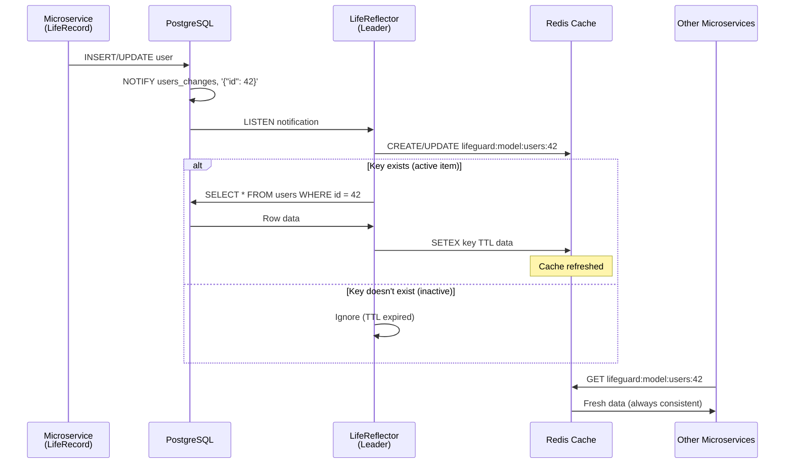
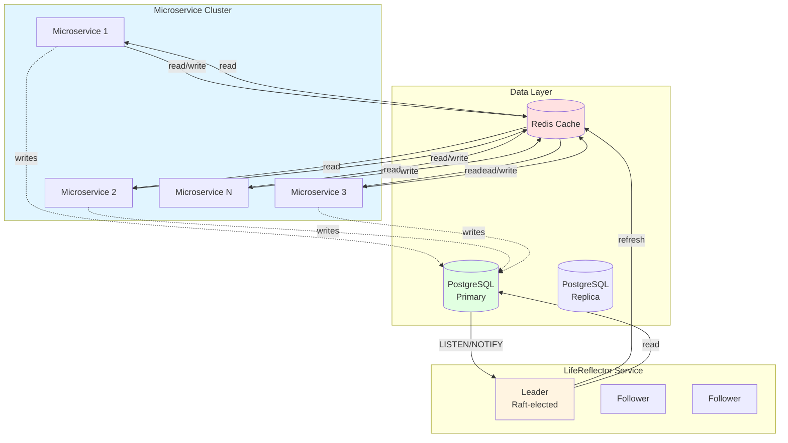

# Lifeguard Reflector

> **Enterprise-grade distributed cache coherence microservice for Lifeguard ORM**

## Overview

**Lifeguard Reflector** is an enterprise component that provides distributed cache coherence for Lifeguard ORM-based microservices. It maintains cluster-wide cache consistency using PostgreSQL LISTEN/NOTIFY and Redis, ensuring zero-stale reads across all microservices.

**Status**: 🏗️ **Enterprise Component - In Development**

This is a **proprietary enterprise component** available to paid Microscaler enterprise customers. Source code is available to licensed users.

## What is Lifeguard Reflector?

Lifeguard Reflector is a **standalone microservice** that solves the distributed cache coherence problem at scale:

- **Leader-elected Raft system**: Only one active reflector at a time (no duplicate work)
- **PostgreSQL LISTEN/NOTIFY integration**: Subscribes to database change events
- **Intelligent cache refresh**: Only updates keys that exist in Redis (TTL-based active set)
- **Zero-stale reads**: Redis always reflects current database state
- **Horizontal scaling**: All microservices benefit from single reflector

### The Problem It Solves

At **millions of requests per second**, cache coherence isn't optional. Without LifeReflector:

- **Cache stampedes**: Cache miss causes thousands of simultaneous database queries
- **Thundering herd**: All microservices try to refresh simultaneously
- **Connection exhaustion**: Cache misses overwhelm your 100-500 connection limit
- **Stale data**: TTL-based expiration means stale reads for up to TTL duration

**With LifeReflector**:
- **99%+ cache hit rate**: Sub-millisecond reads, 100 connections handle millions of requests
- **Zero stale reads**: Redis always reflects current database state
- **Single source of truth**: Coordinated cache refresh prevents simultaneous queries
- **Oracle Coherence-level consistency**: But lighter, faster, and open-source compatible

## Architecture

### How It Works

1. **LifeRecord writes to PostgreSQL** → triggers `NOTIFY users_changes, '{"id": 42}'`
2. **LifeReflector (leader)** receives notification via PostgreSQL LISTEN
3. **Checks if key exists in Redis** (active item in TTL-based active set)
4. **If exists** → refreshes from database → updates Redis
5. **If not** → ignores (inactive item, TTL expired)
6. **All microservices** read from Redis → always fresh data

### System Architecture

## Key Features

### Distributed Cache Coherence

- **Oracle Coherence-level consistency** with PostgreSQL + Redis
- **TTL-based active set**: Only refreshes keys that exist in Redis
- **Zero stale reads**: Redis always reflects current database state
- **Prevents cache stampedes**: Single source of truth for cache invalidation
- **Eliminates thundering herd**: Coordinated cache refresh prevents simultaneous queries

### High Availability

- **Raft consensus**: Leader-elected system ensures only one active reflector
- **Automatic failover**: Followers take over if leader fails
- **Horizontal scaling**: Multiple reflector instances for redundancy

### Performance

- **99%+ cache hit rate**: Sub-millisecond reads from Redis
- **Connection efficiency**: 100 connections handle millions of requests
- **Minimal overhead**: Single database query per cache refresh
- **No application changes**: Transparent to microservices

## Enterprise Licensing

**Lifeguard Reflector is an enterprise component**:

- **Source Available**: Licensed enterprise customers receive source code access
- **Commercial License**: Proprietary license for enterprise use
- **Support**: Enterprise support and SLA available
- **Updates**: Access to latest versions and features

For licensing information, contact: **enterprise@microscaler.io**

## Integration with Lifeguard ORM

Lifeguard Reflector integrates seamlessly with [Lifeguard ORM](https://github.com/microscaler/lifeguard):

- **Transparent operation**: No changes to application code required
- **Automatic cache coherence**: Works with Lifeguard's transparent caching
- **TTL-based active set**: Respects Lifeguard's cache TTL settings
- **Key format**: Uses Lifeguard's standard cache key format (`lifeguard:model:{table}:{id}`)

## Use Cases

### High-Scale Microservices

When you have:
- **50,000+ concurrent users**
- **Millions of requests per second**
- **100-500 database connections**
- **Multiple microservices sharing cache**

LifeReflector makes the impossible possible:
- **Without LifeReflector**: Cache stampedes, stale data, connection exhaustion
- **With LifeReflector**: 99%+ cache hit rate, zero stale reads, system stability

### Multi-Service Data Consistency

When multiple microservices need to read the same data:
- **Service A** updates user profile
- **Service B, C, D** need fresh user data
- **LifeReflector** ensures all services see the update immediately

### Cache Coherence at Scale

At extreme scale:
- **1,000,000 requests/second** with 50,000 concurrent users
- **Without caching**: Impossible (1,000 seconds of DB time per second)
- **With 95% cache hit**: Still impossible (50 seconds of DB time per second)
- **With LifeReflector (99%+ hit)**: Possible (10 seconds of DB time per second)

## Project Status

**Current Status**: 🏗️ **In Development**

- [ ] Core Raft consensus implementation
- [ ] PostgreSQL LISTEN/NOTIFY integration
- [ ] Redis cache refresh logic
- [ ] TTL-based active set management
- [ ] Leader election and failover
- [ ] Monitoring and observability
- [ ] Kubernetes deployment manifests
- [ ] Documentation and examples

## Technology Stack

- **Language**: Rust (for performance and reliability)
- **Database**: PostgreSQL (LISTEN/NOTIFY)
- **Cache**: Redis
- **Consensus**: Raft algorithm
- **Deployment**: Kubernetes-ready

## Related Projects

- **[Lifeguard ORM](https://github.com/microscaler/lifeguard)**: The ORM that LifeReflector enhances
- **[PriceWhisperer](https://github.com/microscaler/pricewhisperer)**: Example system using Lifeguard + LifeReflector
- **[RERP](https://github.com/microscaler/rerp)**: Enterprise ERP using Lifeguard + LifeReflector

## License

**Proprietary Enterprise License**

This is a proprietary enterprise component. Source code is available to licensed enterprise customers.

For licensing information, contact: **enterprise@microscaler.io**

---

**Repository**: https://github.com/microscaler/lifeguard-reflector (Private - Enterprise Access)  
**License**: Proprietary Enterprise License  
**Status**: In Development
