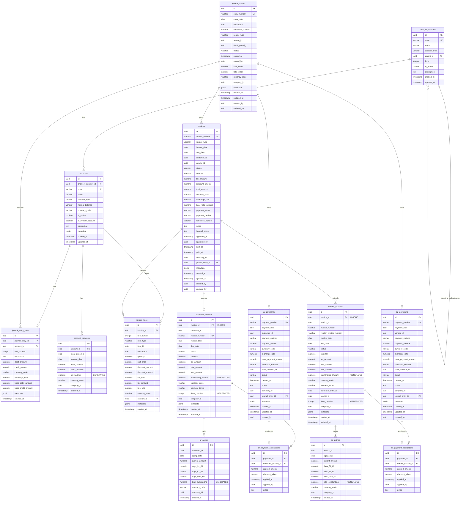
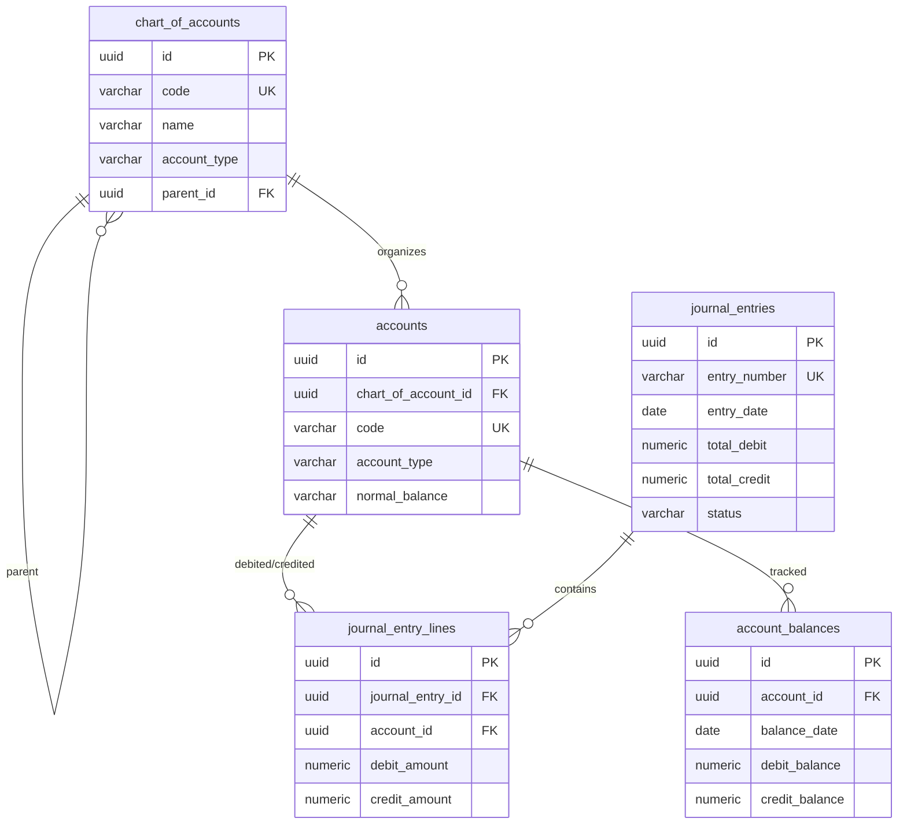
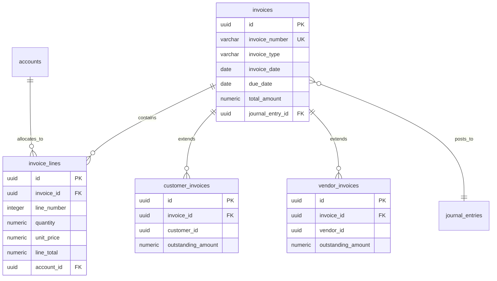
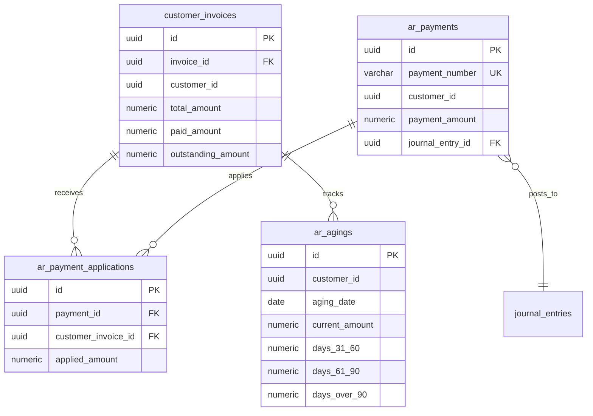
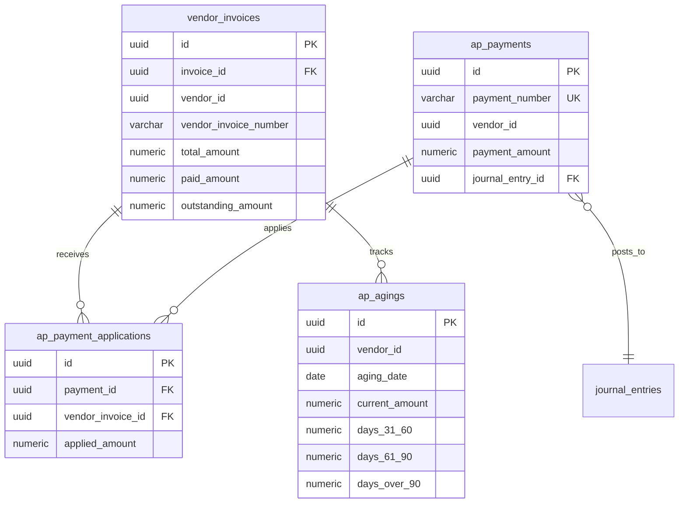

# RERP Accounting Database - Entity Relationship Diagram

This document provides a visual representation of the accounting database schema using Mermaid ERD syntax.

## Full Schema ERD



## Module Breakdown

### 1. General Ledger Module



### 2. Invoice Management Module



### 3. Accounts Receivable Module



### 4. Accounts Payable Module



## Key Relationships

### Hierarchical Relationships
- **chart_of_accounts** → **chart_of_accounts** (self-reference via `parent_id`)
  - Creates hierarchical account structure
  - Supports account rollups and reporting

### One-to-Many Relationships
- **chart_of_accounts** → **accounts** (1:N)
  - One chart of accounts entry can have many accounts
- **journal_entries** → **journal_entry_lines** (1:N)
  - One journal entry contains multiple debit/credit lines
- **invoices** → **invoice_lines** (1:N)
  - One invoice contains multiple line items
- **accounts** → **journal_entry_lines** (1:N)
  - One account can appear in many journal entry lines
- **accounts** → **account_balances** (1:N)
  - One account can have multiple balance snapshots

### One-to-One Relationships
- **invoices** → **customer_invoices** (1:1 via `invoice_id`)
  - Customer invoice extends base invoice
- **invoices** → **vendor_invoices** (1:1 via `invoice_id`)
  - Vendor invoice extends base invoice

### Many-to-Many Relationships (via junction tables)
- **customer_invoices** ↔ **ar_payments** (via `ar_payment_applications`)
  - Multiple payments can apply to one invoice
  - One payment can apply to multiple invoices
- **vendor_invoices** ↔ **ap_payments** (via `ap_payment_applications`)
  - Multiple payments can apply to one invoice
  - One payment can apply to multiple invoices

### Posting Relationships
- **journal_entries** ← **invoices** (via `journal_entry_id`)
  - Invoices post to journal entries when approved
- **journal_entries** ← **ar_payments** (via `journal_entry_id`)
  - AR payments post to journal entries when cleared
- **journal_entries** ← **ap_payments** (via `journal_entry_id`)
  - AP payments post to journal entries when cleared

## Data Flow

### Invoice to Journal Entry Flow
```
Invoice Created → Invoice Approved → Journal Entry Created → Journal Entry Posted
```

### Payment Application Flow
```
Payment Received → Payment Application → Invoice Updated (paid_amount) → Journal Entry Posted
```

### Balance Calculation Flow
```
Journal Entry Posted → Journal Entry Lines → Account Balances Updated → Aging Calculated
```

## Cardinality Summary

| Relationship | Cardinality | Notes |
|-------------|-------------|-------|
| chart_of_accounts → accounts | 1:N | One chart entry, many accounts |
| accounts → journal_entry_lines | 1:N | One account, many transactions |
| journal_entries → journal_entry_lines | 1:N | One entry, many lines |
| invoices → invoice_lines | 1:N | One invoice, many line items |
| invoices → customer_invoices | 1:1 | One-to-one extension |
| invoices → vendor_invoices | 1:1 | One-to-one extension |
| customer_invoices ↔ ar_payments | M:N | Via ar_payment_applications |
| vendor_invoices ↔ ap_payments | M:N | Via ap_payment_applications |
| journal_entries ← invoices | N:1 | Many invoices, one journal entry |
| journal_entries ← ar_payments | N:1 | Many payments, one journal entry |
| journal_entries ← ap_payments | N:1 | Many payments, one journal entry |

## Notes

- **PK** = Primary Key
- **FK** = Foreign Key
- **UK** = Unique Key
- **GENERATED** = Generated column (computed)
- All monetary amounts use `NUMERIC(19, 4)` precision
- All timestamps use `TIMESTAMP` (not `TIMESTAMPTZ`)
- All primary keys are `UUID` with `gen_random_uuid()` default
- Multi-company support via `company_id` fields
- Multi-currency support via `currency_code` and `exchange_rate` fields
